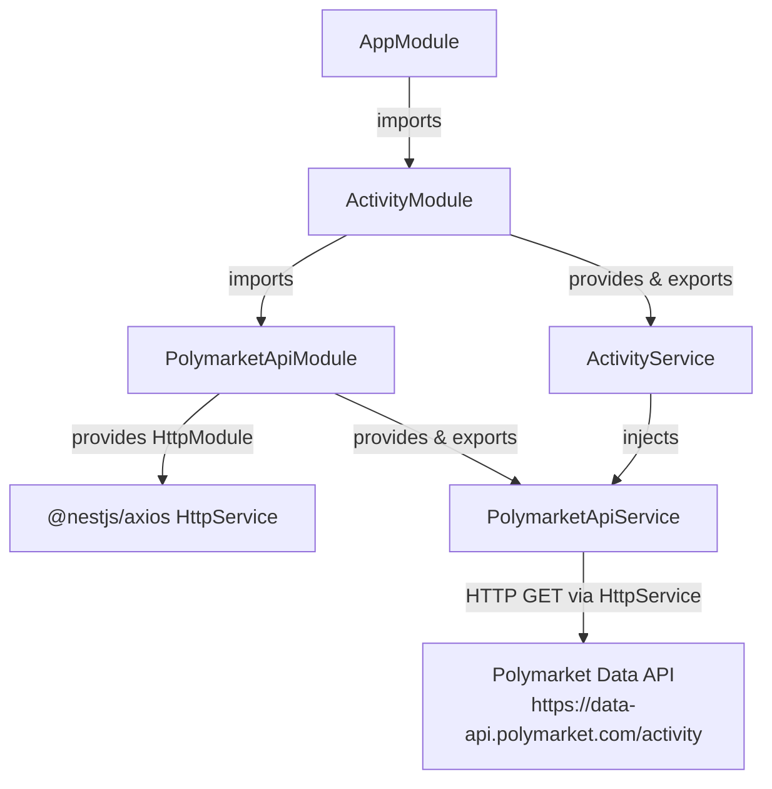
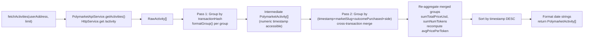

# ADR: Polymarket Activity Module — Production Architecture Decisions

## Status

Accepted

## Context

The Polymarket activity service was built as a POC in `src/research/` to validate the API integration and aggregation algorithm ported from a Python script. The POC design document explicitly deferred three architectural decisions, noting that they must be resolved before the service leaves POC status:

1. **HTTP client**: The POC used raw `axios.get()` directly inside the service. The design doc noted that if axios is retained in production, an ADR must be created and that `@nestjs/axios` injection should be adopted at that time.
2. **Module structure**: The POC placed all logic in a single service inside a catch-all `src/research/` module. Moving to production requires a module layout that follows NestJS bounded-context conventions.
3. **Cross-transaction deduplication**: The POC grouped trades only within the same `transactionHash`. The Polymarket API can return semantically identical trades across different transaction hashes (same timestamp, market, outcome, direction). This was deferred at POC stage as out of scope.

This ADR documents the decisions made for each of these three areas as the service is promoted to production.

---

## Decision 1: @nestjs/axios over raw axios for HTTP communication

### Decision

Use `@nestjs/axios` (`HttpModule` + `HttpService`) instead of raw `axios.get()` for all HTTP calls in `PolymarketApiService`.

### Decision Details

| Item | Content |
|------|---------|
| **Decision** | Import `HttpModule` from `@nestjs/axios` into `PolymarketApiModule`; inject `HttpService` into `PolymarketApiService` via the NestJS DI container |
| **Why now** | The service is being promoted to production. The POC design doc explicitly required an ADR before the service left POC status if raw axios was retained. Unit testability of business logic is a stated production requirement in the PRD. |
| **Why this** | `@nestjs/axios` makes the HTTP layer injectable and therefore replaceable in tests without live network calls. No new package family is introduced — `@nestjs/axios` wraps the `axios` that is already present in `package.json`. |
| **Known unknowns** | `HttpService` methods return RxJS `Observable`s, not `Promise`s. All call sites must use `firstValueFrom()` from `rxjs` to convert. The `rxjs` package is already a project dependency, but this is a new usage pattern in this codebase. |
| **Kill criteria** | If `@nestjs/axios` introduces an incompatibility with a future NestJS major version and no migration path exists, revert to a direct `axios` instance wrapped in an injectable provider class. |

### Options Considered

#### Option A: Raw axios (POC approach — rejected)

`axios.get()` called directly inside the service using a top-level import.

- Pros: Zero boilerplate; service is self-contained; no new dependency
- Cons: HTTP layer is not injectable; unit tests of business logic require a module-level mock patch or a live network call; not idiomatic NestJS for production services; tightly couples HTTP transport to business logic

#### Option B: @nestjs/axios HttpService (selected)

`HttpModule` imported into the feature module; `HttpService` injected via constructor DI.

- Pros: HTTP layer is injectable and mockable in unit tests via NestJS `Test.createTestingModule` overrides; idiomatic production NestJS pattern; no new runtime package family (`@nestjs/axios` wraps existing `axios`); enables future transport enhancements (interceptors, retry, circuit-breaking) without touching business logic
- Cons: Adds `firstValueFrom(observable)` boilerplate at each call site to convert `Observable` to `Promise`; one additional `HttpModule.register()` call in the module definition

#### Option C: Node.js built-in fetch (rejected)

Use the native `fetch` API available in Node.js 18+.

- Pros: Zero additional dependencies; no abstraction layer
- Cons: Not injectable via NestJS DI in the standard pattern; no community-established interceptor ecosystem for NestJS; would require a custom wrapper class to make it testable, duplicating what `@nestjs/axios` already provides; less community support for production NestJS HTTP patterns

### Consequences

**Positive**

- `PolymarketApiService` is mockable in unit tests without live network calls, enabling `ActivityService` business logic to be tested with fixture data
- Transport-layer concerns (retry, circuit-breaking, interceptors) can be added to `PolymarketApiModule` without touching `ActivityService`
- Consistent with idiomatic NestJS patterns documented in the official framework docs

**Negative**

- Each `HttpService` call requires `firstValueFrom(this.httpService.get(...))` instead of `axios.get(...)`; this is minor boilerplate but a new import convention for this codebase

**Neutral**

- `axios` remains in `package.json` as a peer dependency of `@nestjs/axios`; it is not removed

### Implementation Guidance

- Add `@nestjs/axios ^4.x` as a runtime dependency in `package.json` before implementation (`npm install @nestjs/axios`). The existing `axios` package remains as a peer dependency and does not need to be removed.
- Import `HttpModule` from `@nestjs/axios` in `PolymarketApiModule`; do not import `HttpModule` in `ActivityModule` directly
- Inject `HttpService` into `PolymarketApiService` via constructor parameter injection
- Use `firstValueFrom(observable)` from `rxjs` to convert `HttpService` responses to `Promise`s; do not subscribe manually
- HTTP errors must propagate as thrown exceptions; do not catch inside `PolymarketApiService`

---

## Decision 2: Two-module architecture (PolymarketApiModule + ActivityModule)

### Decision

Replace the single `src/research/` POC module with two dedicated NestJS modules: `src/polymarket-api/` for HTTP communication and `src/activity/` for business logic.

### Decision Details

| Item | Content |
|------|---------|
| **Decision** | `PolymarketApiModule` owns HTTP transport and `RawActivity` types; `ActivityModule` owns aggregation logic and imports `PolymarketApiModule` |
| **Why now** | The service is being promoted to production and will be consumed by future modules. The POC's single catch-all module cannot support independent testing of transport vs. business logic. |
| **Why this** | Single Responsibility Principle at the module level: HTTP concerns and business logic concerns change for different reasons. Two modules allow each layer to be tested and extended without coupling risk. |
| **Known unknowns** | The split adds a second `providers`/`exports` declaration and a module import chain. There is no current evidence this creates any NestJS DI resolution issue, but the pattern has not yet been used in this specific codebase. |
| **Kill criteria** | If the module boundary creates circular dependency issues as the codebase grows, consider merging back into one module or introducing an interface-based abstraction layer. |

### Options Considered

#### Option A: One combined module (POC approach — rejected)

A single `src/polymarket/` module containing both the HTTP service and the business logic service.

- Pros: Fewer files; simpler module graph; no cross-module import needed
- Cons: HTTP concerns coupled to business logic; unit testing `ActivityService` requires mocking at a lower level than the module boundary; changing transport requires touching the same module that owns business logic; violates Single Responsibility Principle at the module level

#### Option B: Two modules — PolymarketApiModule + ActivityModule (selected)

`src/polymarket-api/` handles HTTP and raw types; `src/activity/` handles aggregation and exposes the consumer-facing interface.

- Pros: Each module has a single responsibility and a single reason to change; `PolymarketApiService` is swappable in `ActivityService` unit tests by providing a mock at module boundary; idiomatic NestJS bounded-context layout; transport changes are isolated to `PolymarketApiModule`
- Cons: Additional module file and imports; cross-module dependency requires `PolymarketApiModule` to be imported by `ActivityModule`

#### Option C: Three modules — PolymarketApiModule + AggregationModule + ActivityModule (rejected)

Extract the aggregation pipeline into its own module, with `ActivityModule` as an orchestration layer.

- Pros: Maximum separation of concerns; aggregation logic could theoretically be reused with other data sources
- Cons: Over-engineering for current requirements (YAGNI); the aggregation logic is specific to Polymarket's data shape; an additional module boundary without a concrete second consumer adds indirection without present benefit

### Consequences

**Positive**

- `ActivityService` unit tests mock only `PolymarketApiService` at the module boundary; no internal methods are mocked
- HTTP transport can be replaced (retry, circuit-breaking, alternative base URL) by modifying only `PolymarketApiModule`
- Module layout is immediately recognizable as idiomatic NestJS to any developer familiar with the framework
- `src/research/` is deleted; no catch-all module remains in the codebase

**Negative**

- Two files and two module declarations instead of one
- `ActivityModule` has an explicit `imports: [PolymarketApiModule]` dependency that must be maintained

**Neutral**

- `AppModule` imports `ActivityModule` in place of the deleted `ResearchModule`; the import array changes but the wiring pattern is identical

### Implementation Guidance

- `PolymarketApiModule` must export `PolymarketApiService`; types in `polymarket-api.types.ts` are exported directly and do not require module-level export declarations
- `ActivityModule` must declare `PolymarketApiModule` in its `imports` array; it must not import `HttpModule` directly
- `ActivityService` must depend on `PolymarketApiService` exclusively through NestJS DI constructor injection; direct `import` of the class for instantiation is not permitted

---

## Decision 3: Cross-transaction deduplication as an in-process pipeline step

### Decision

Add a second grouping pass inside `ActivityService.fetchActivities()` that merges intermediate `PolymarketActivity` records sharing the composite key `(numeric timestamp, marketSlug, outcomePurchased, side)`, regardless of their `transactionHash` values.

### Decision Details

| Item | Content |
|------|---------|
| **Decision** | After the first grouping pass (by `transactionHash`), apply a second in-memory grouping pass using the four-field composite key before sorting and returning |
| **Why now** | The API returns semantically identical trades across different transaction hashes. Without this step, consumers receive duplicate records. The service is being promoted to production and will be consumed by a notification module that must not trigger duplicate alerts. |
| **Why this** | Stateless in-process deduplication requires no persistence infrastructure, no external state, and no coordination between calls. The API returns at most 500 records per call; grouping 500 records in memory is computationally negligible. |
| **Known unknowns** | Exact integer equality for the `timestamp` field relies on the API consistently returning the same Unix timestamp for same-block transactions. If the API returns fractional or inconsistent timestamps for same-block trades, the merge would silently fail to collapse duplicates. |
| **Kill criteria** | If duplicate records are observed in production output after this change, re-evaluate whether the timestamp equality assumption holds for the specific API response patterns in use. |

### Options Considered

#### Option A: No deduplication (POC approach — rejected)

Return all records after the first `transactionHash` grouping pass without any cross-transaction merge.

- Pros: Simplest implementation; no additional pipeline step; matches POC behaviour exactly
- Cons: Consumers receive duplicate entries for trades that the API returns under multiple transaction hashes; a future notification module would fire duplicate alerts; the PRD explicitly identifies this as a required production improvement

#### Option B: In-process pipeline step (selected)

After the first grouping pass, apply a second in-memory pass using the composite key `(numeric timestamp + marketSlug + outcomePurchased + side)`.

- Pros: Stateless — no persistence or infrastructure required; exact integer equality for timestamp is safe given the API returns the same Unix timestamp for same-block transactions; operates on at most 500 records (max API page size), negligible memory overhead; eliminates duplicates before they reach consumers; testable with fixture data in unit tests without any external dependency
- Cons: Adds a second iteration over the intermediate result set; introduces a `(timestamp, marketSlug, outcomePurchased, side)` composite key that must be kept consistent with the API's field semantics; if the timestamp equality assumption fails, merges are silently skipped rather than raising an error

#### Option C: Persistence-based deduplication (rejected)

Store a seen-key set in a database or cache; filter out duplicates on subsequent calls by comparing against persisted state.

- Pros: Handles cross-call duplicates in addition to within-call duplicates
- Cons: Adds infrastructure dependency (database or cache); complicates the stateless service contract; introduces failure modes (persistence unavailable) not present in in-process approach; out of scope per PRD (cross-call deduplication is explicitly listed as out of scope)

#### Option D: Fuzzy timestamp matching (rejected)

Merge records whose timestamps fall within a configurable window (e.g., ±1 second) rather than requiring exact equality.

- Pros: More resilient to minor timestamp inconsistencies from the API
- Cons: Introduces edge cases: two genuinely distinct trades placed in the same market within 1 second would be incorrectly merged; the window value is arbitrary and requires tuning; the API's observed behaviour returns exact integer equality for same-block transactions, making fuzzy matching unnecessary complexity without clear benefit

### Consequences

**Positive**

- Consumers receive a deduplicated activity list; duplicate notifications and display artifacts are prevented
- The deduplication logic is stateless and testable with fixture data in unit tests
- No infrastructure dependency is added; the service remains horizontally scalable without coordination

**Negative**

- The `timestamp` composite key component relies on exact integer equality; this assumption must hold at the API contract level and is not validated at runtime
- Consumers who were relying on receiving all raw trade records (including duplicates) would see fewer records; there are no such consumers at this time

**Neutral**

- The second pass operates on intermediate `PolymarketActivity` records, not on `RawActivity` records; the numeric timestamp must remain accessible on the intermediate type (or be carried through from the first pass) to support the composite key computation
- `activityCount` and numeric aggregation fields (`totalPriceUsd`, `numTokens`, `avgPricePerToken`) are re-aggregated across merged records using the same rules as the first pass

### Implementation Guidance

- The second grouping pass must operate on the intermediate pipeline state where the numeric `timestamp` is still available; format the `date` string only after both passes complete
- Composite key construction: use `JSON.stringify([numericTimestamp, marketSlug, outcomePurchased, side])` as the composite key; this avoids separator collision issues since field values may contain underscores (the Polymarket API returns slug values with hyphens, not underscores, but JSON serialization eliminates any ambiguity)
- When two records are merged, `transactionHash` is taken from the first record in the merged group (input order)
- `avgPricePerToken` must be recomputed from the merged `totalPriceUsd / numTokens` totals, rounded to 4dp; do not average the `avgPricePerToken` values from the individual records

---

## Architecture Overview

## Data Flow

---

## References

- PRD: `docs/prd/20260226-activity-module-production.md` — Production requirements and acceptance criteria for all three decisions
- POC Design Document: `docs/design/polymarket-activity-service-design.md` — Original POC decisions, deferred ADR notes, and field propagation map
- [NestJS HTTP Module documentation](https://docs.nestjs.com/techniques/http-module) — `HttpModule`, `HttpService`, Observable-to-Promise conversion with `firstValueFrom`
- [NestJS Modules documentation](https://docs.nestjs.com/modules) — Module declaration, `imports`, `exports`, bounded-context conventions
- [@nestjs/axios npm package](https://www.npmjs.com/package/@nestjs/axios) — Version compatibility (`^4.x` for NestJS 11) and peer dependency on axios
- [RxJS firstValueFrom](https://rxjs.dev/api/index/function/firstValueFrom) — Canonical pattern for converting an Observable to a Promise in NestJS services

## Update History

| Date | Version | Changes | Author |
|------|---------|---------|--------|
| 2026-02-26 | 1.0 | Initial version — three decisions: @nestjs/axios, two-module architecture, cross-transaction deduplication | Claude (ADR) |
| 2026-02-26 | 1.1 | I001: Updated @nestjs/axios version to ^4.x (v4.x is correct for NestJS 11, not v3.x). I002: Added explicit package.json dependency installation step to Decision 1 Implementation Guidance. I005: Replaced ambiguous underscore composite key separator with JSON.stringify array key. I006: Consolidated duplicate Related Information and References into single References section. | Claude (document-reviewer fix) |
