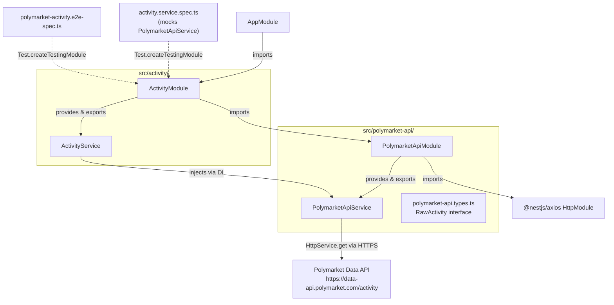
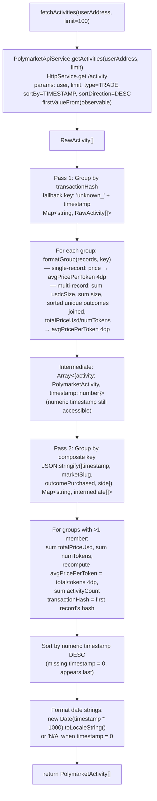

# Activity Module — POC to Production Promotion Design Document

## Overview

Promote the Polymarket activity service from a single POC service in `src/research/` into two production-ready NestJS modules (`PolymarketApiModule` and `ActivityModule`) with full unit test coverage, an injectable HTTP layer, and an improved two-pass aggregation pipeline that eliminates cross-transaction duplicate records before they reach consumers.

## Design Summary (Meta)

```yaml
design_type: "refactoring"
risk_level: "low"
complexity_level: "medium"
complexity_rationale: |
  (1) The two-pass aggregation pipeline manages an intermediate data representation
      (numeric timestamp + PolymarketActivity) that does not appear in either the
      input or output interfaces — AC FR-7 requires the numeric timestamp to remain
      accessible between pass 1 and pass 2, then be discarded before return.
      AC FR-6 requires a single formatGroup function that handles both single-record
      and multi-record cases without divergent code paths.
  (2) The migration involves deleting an in-use module (ResearchModule), replacing
      two test files' imports, and wiring a new two-module DI graph — all while
      keeping the existing app.e2e-spec.ts passing throughout.
main_constraints:
  - "PolymarketApiService must use injected HttpService — raw axios import prohibited in ActivityService"
  - "Module boundaries respected: ActivityService depends on PolymarketApiService via DI only"
  - "TypeScript strict mode (strictNullChecks, noImplicitAny) applies to all new files"
  - "E2E test files must match .e2e-spec.ts$ per test/jest-e2e.json"
  - "Unit test files must match .*[-.]spec.ts$ and reside under src/"
  - "AppController and AppService must not be modified"
biggest_risks:
  - "Live API call in e2e test is non-deterministic if address loses trade history"
  - "Cross-transaction merge changes output for existing consumers (currently none — acceptable)"
  - "Observable vs Promise conversion with firstValueFrom is a new pattern in this codebase"
unknowns:
  - "Confirmed: @nestjs/axios ^4.x is NOT installed. package.json has axios ^1.x only. Step 1 of implementation order is unconditional: npm install @nestjs/axios"
```

## Background and Context

### Prerequisite ADRs

- `docs/adr/20260226-polymarket-activity-production-architecture.md`:
  - Decision 1: Use `@nestjs/axios ^4.x` (`HttpModule` + `HttpService`). HTTP calls in `PolymarketApiService` must use injected `HttpService`; `firstValueFrom()` converts Observable to Promise at each call site.
  - Decision 2: Two-module architecture — `PolymarketApiModule` (`src/polymarket-api/`) owns HTTP transport and `RawActivity` types; `ActivityModule` (`src/activity/`) owns aggregation logic and imports `PolymarketApiModule`.
  - Decision 3: Cross-transaction deduplication as an in-process second grouping pass using composite key `JSON.stringify([timestamp, marketSlug, outcomePurchased, side])`.

### Agreement Checklist

#### Scope
- [x] Create `src/polymarket-api/polymarket-api.types.ts` — `RawActivity` interface
- [x] Create `src/polymarket-api/polymarket-api.service.ts` — `PolymarketApiService` using `HttpService`
- [x] Create `src/polymarket-api/polymarket-api.module.ts` — `PolymarketApiModule` with `HttpModule`
- [x] Create `src/activity/activity.service.ts` — `ActivityService` with two-pass aggregation
- [x] Create `src/activity/activity.module.ts` — `ActivityModule` importing `PolymarketApiModule`
- [x] Create `src/activity/activity.service.spec.ts` — 6 unit test scenarios with mocked `PolymarketApiService`
- [x] Modify `src/app.module.ts` — swap `ResearchModule` import for `ActivityModule`
- [x] Update `test/polymarket-activity.e2e-spec.ts` — update module/service imports, add fixture-based cross-transaction merge test
- [x] Verify `test/app.e2e-spec.ts` continues to pass after module swap
- [x] Delete `src/research/polymarket-activity.service.ts`
- [x] Delete `src/research/polymarket-activity.module.ts`
- [x] Add `@nestjs/axios` runtime dependency (`npm install @nestjs/axios`)

#### Non-Scope (Explicitly not changing)
- [x] No `ActivityController` — service is available via DI only; no REST endpoint added
- [x] No caching, polling, or background scheduling
- [x] No cross-call deduplication or persistence of any kind
- [x] No input validation on `userAddress` format (lowercasing is the only transform)
- [x] No structured logging added
- [x] No error wrapping or retry logic — HTTP errors propagate as-is
- [x] `src/app.controller.ts`, `src/app.service.ts`, `src/main.ts` — untouched
- [x] `test/app.e2e-spec.ts` — not modified; existing test must continue to pass

#### Constraints
- [x] Parallel operation: Not applicable (replacement, no parallel running period)
- [x] Backward compatibility: No external consumers exist. Internal consumers (`app.e2e-spec.ts`) must continue to pass.
- [x] Performance measurement: Not required for this scope

#### Applicable Standards
- [x] Single quotes, trailing commas `[explicit]` — Source: `.prettierrc` (`singleQuote: true`, `trailingComma: "all"`)
- [x] `@Injectable()` decorator on services `[explicit]` — Source: NestJS framework convention, `src/app.service.ts`
- [x] `@Module()` decorator on modules `[explicit]` — Source: NestJS framework convention, `src/app.module.ts`
- [x] `strictNullChecks`, `noImplicitAny` enabled `[explicit]` — Source: `tsconfig.json`
- [x] `emitDecoratorMetadata` + `experimentalDecorators` enabled `[explicit]` — Source: `tsconfig.json`
- [x] E2E tests live under `test/` with suffix `.e2e-spec.ts` `[explicit]` — Source: `test/jest-e2e.json` (`testRegex: ".e2e-spec.ts$"`)
- [x] Unit tests live under `src/` with suffix `[-.]spec.ts` `[explicit]` — Source: `package.json` jest config (`rootDir: "."`, `testRegex: ".*[-.]spec\\.ts$"`)
- [x] Constructor-based DI injection `[implicit]` — Evidence: `src/app.controller.ts` constructor injection pattern; `src/app.service.ts` `@Injectable()` class

### Problem to Solve

The POC service in `src/research/` cannot be safely consumed by future modules because its HTTP layer is not injectable (raw `axios.get` is called directly inside the service class), the business logic has no unit tests, and the module layout does not follow NestJS bounded-context conventions. Additionally, the single-pass aggregation pipeline allows semantically identical trades that the Polymarket API returns across different transaction hashes to appear as duplicate records to consumers.

### Current Challenges

- Raw `axios` import in `PolymarketActivityService` means `fetchActivities` cannot be unit-tested without a live network call or a module-level mock patch — neither is acceptable for production code.
- `ResearchModule` is a catch-all module that combines HTTP transport and business logic in one service, making each layer impossible to change without touching the other.
- No unit tests exist for the aggregation logic (`formatSingle`, `aggregateGroup`, sort order, missing-timestamp handling).
- Cross-transaction duplicates are not collapsed — a future notification consumer would fire duplicate alerts.

### Requirements

#### Functional Requirements

- FR-1: `PolymarketApiModule` exports `PolymarketApiService`; any module importing it can resolve the service via DI
- FR-2: `PolymarketApiService.getActivities(userAddress, limit)` returns `Promise<RawActivity[]>` using injected `HttpService`
- FR-3: `RawActivity` interface defined in `polymarket-api.types.ts` with all optional API fields
- FR-4: `ActivityModule` imports `PolymarketApiModule` and exports `ActivityService`
- FR-5: `ActivityService.fetchActivities` retrieves raw records, runs pass 1 (group by transactionHash, formatGroup), produces intermediate array
- FR-6: `formatGroup` is the single unified function replacing `formatSingle` + `aggregateGroup`
- FR-7: Pass 2 merges intermediate records sharing `(timestamp, marketSlug, outcomePurchased, side)` composite key
- FR-8: Final output sorted by numeric timestamp descending; missing timestamps treated as 0
- FR-9: `AppModule` imports `ActivityModule` instead of `ResearchModule`; application starts without error
- FR-10: `src/research/` directory deleted; no remaining imports reference it
- FR-11: Unit tests in `src/activity/activity.service.spec.ts` cover 6 scenarios (see AC section)
- FR-12: `test/polymarket-activity.e2e-spec.ts` updated to use new module/service imports; adds fixture-based cross-transaction merge test

#### Non-Functional Requirements

- **Reliability**: HTTP errors propagate as unhandled exceptions; no partial results or default fallbacks
- **Maintainability**: `PolymarketApiService` injected via DI; `formatGroup` is a single function without divergent single/multi paths
- **Security**: `userAddress` lowercased before use as query parameter; HTTPS only; no credentials required
- **Testability**: All aggregation logic unit-testable with mocked `PolymarketApiService`; no live network required for unit tests
- **Performance**: Stateless; at most 500 records processed in memory per call; no measurable overhead requirement

---

## Acceptance Criteria (AC) — EARS Format

### FR-1: PolymarketApiModule

- [ ] When `ActivityModule` is imported into a `TestingModule`, the system shall resolve `ActivityService` via DI without error, confirming the transitive `PolymarketApiModule` import chain is intact.
- [ ] When any module declares `PolymarketApiModule` in its `imports` array, the system shall make `PolymarketApiService` available for constructor injection.

### FR-2: PolymarketApiService.getActivities

- [ ] When `getActivities(userAddress, limit)` is called with a valid Ethereum address, the system shall issue `GET https://data-api.polymarket.com/activity` with query params `user=<address lowercased>`, `limit=<limit>`, `type=TRADE`, `sortBy=TIMESTAMP`, `sortDirection=DESC` and return the parsed `RawActivity[]` array.
- [ ] If the HTTP response status is non-2xx, then the system shall propagate the error without wrapping it.

### FR-3: RawActivity type definition

- [ ] The `RawActivity` interface shall define all of the following optional fields: `transactionHash`, `timestamp`, `title`, `eventSlug`, `slug`, `outcome`, `side`, `usdcSize`, `size`, `price`.
- [ ] `RawActivity` shall be importable from `src/polymarket-api/polymarket-api.types.ts`.

### FR-4: ActivityModule

- [ ] When `ActivityModule` is added to `AppModule.imports`, the application shall start without DI resolution error.
- [ ] `ActivityService` shall be exportable from `ActivityModule` and injectable into any module that imports `ActivityModule`.

### FR-5 & FR-6: formatGroup — single-record group

- [ ] When `fetchActivities` is called and the raw response contains a single record with `transactionHash = "0xAAA"`, the system shall return one activity with `transactionHash = "0xAAA"`, `activityCount = 1`, `avgPricePerToken` equal to the record's `price` rounded to 4dp, `totalPriceUsd` equal to `usdcSize` rounded to 2dp, and `numTokens` equal to `size` rounded to 2dp.
- [ ] When a single-record group has no `timestamp`, then `date` shall be `'N/A'`.
- [ ] When a single-record group has no `eventSlug`, then `eventLink` shall be `'N/A'`.
- [ ] When a single-record group has no `outcome`, then `outcomePurchased` shall be `'Unknown'`.

### FR-5 & FR-6: formatGroup — multi-record group

- [ ] When `fetchActivities` is called and multiple raw records share the same `transactionHash`, the system shall return one activity where `totalPriceUsd` equals the sum of all `usdcSize` values rounded to 2dp, `numTokens` equals the sum of all `size` values rounded to 2dp, and `avgPricePerToken` equals `totalPriceUsd / numTokens` rounded to 4dp.
- [ ] When multiple records in the same group have distinct `outcome` values, the system shall return `outcomePurchased` as the unique values sorted alphabetically and joined with `', '`.
- [ ] When a multi-record group has `totalSize = 0`, then `avgPricePerToken` shall be `0`.

### FR-7: Cross-transaction merge (pass 2)

- [ ] When two intermediate records share the same numeric `timestamp`, `marketSlug`, `outcomePurchased`, and `side` but have different `transactionHash` values, the system shall return exactly one merged record in the output.
- [ ] When two records are merged, the output `totalPriceUsd` shall equal the sum of both records' `totalPriceUsd` values, `numTokens` shall equal the sum of both records' `numTokens` values, `avgPricePerToken` shall equal `mergedTotalPriceUsd / mergedNumTokens` rounded to 4dp (not an average of the two `avgPricePerToken` values), and `activityCount` shall equal the sum of both records' `activityCount` values.
- [ ] When two records are merged, the output `transactionHash` shall equal the `transactionHash` of the first record in the merged group (input order preserved).
- [ ] When two intermediate records differ in any one of `timestamp`, `marketSlug`, `outcomePurchased`, or `side`, the system shall not merge them and shall return both as separate records.

### FR-8: Sort order

- [ ] The output of `fetchActivities` shall be sorted by numeric timestamp descending — for any adjacent pair `[i]` and `[i+1]`, the timestamp of item `[i]` shall be greater than or equal to the timestamp of item `[i+1]`.
- [ ] When a record has no `timestamp` in the raw API response, the system shall treat it as timestamp `0` for sort purposes, placing it last in the output.

### FR-9: AppModule update

- [ ] When `AppModule` is used to bootstrap the application, the system shall start without error after `ActivityModule` replaces `ResearchModule` in `AppModule.imports`.
- [ ] The existing `test/app.e2e-spec.ts` `GET /` test shall continue to return `200 "Hello World!"`.

### FR-10: POC cleanup

- [ ] No file shall exist under `src/research/` after the deletion.
- [ ] No import in any remaining source or test file shall reference a path containing `src/research`.

### FR-11: Unit tests (6 required scenarios)

- [ ] A unit test covering single-record group output shape shall assert all `PolymarketActivity` fields with exact literal values.
- [ ] A unit test covering multi-record group aggregation math shall assert summed `totalPriceUsd`, summed `numTokens`, and computed `avgPricePerToken` with exact values.
- [ ] A unit test covering cross-transaction merge shall assert that two fixtures sharing all four composite-key fields produce exactly one merged output record with correct sums and recomputed average.
- [ ] A unit test covering no-merge on field mismatch shall assert that two fixtures differing in any key field produce two separate output records.
- [ ] A unit test covering sort order shall assert descending timestamp order across at least three fixtures with distinct timestamps.
- [ ] A unit test covering missing timestamp shall assert that a fixture without `timestamp` appears last in the output array.

### FR-12: E2E test update

- [ ] The updated `test/polymarket-activity.e2e-spec.ts` shall import `ActivityModule` and `ActivityService` (not `ResearchModule` or `PolymarketActivityService`).
- [ ] A fixture-based test case shall provide two synthetic `RawActivity` records with the same `timestamp`, `slug`, `outcome`, and `side` but different `transactionHash` values, mock `PolymarketApiService.getActivities` to return them, call `ActivityService.fetchActivities`, and assert exactly one output record with the correct summed `totalPriceUsd`, `numTokens`, `activityCount`, and recomputed `avgPricePerToken`.
- [ ] The live-API test calling `fetchActivities('0x2005d16a84ceefa912d4e380cd32e7ff827875ea', 50)` shall return a non-empty array with all required fields present and non-null on every item.

---

## Existing Codebase Analysis

### Similar Functionality Search

Searched for HTTP client usage, service patterns, and module patterns across `src/`:

- `src/research/polymarket-activity.service.ts` — existing POC implementation; this is the source of truth for the aggregation algorithm being ported. Contains `formatSingle` and `aggregateGroup` methods to be consolidated.
- `src/research/polymarket-activity.module.ts` — existing POC module; provides the `ResearchModule` class being deleted.
- No other HTTP client usage in `src/`; no other module implementing activity/trade aggregation logic.
- No `@nestjs/axios` usage in the codebase — this is a new import pattern.

Decision: **Replace existing implementation** — the POC files are the source being refactored. The two new module directories (`src/polymarket-api/`, `src/activity/`) follow the same NestJS patterns observed in `src/app.module.ts` and `src/app.service.ts`.

### Implementation Path Mapping

| Type | Path | Description |
|------|------|-------------|
| Existing (delete) | `src/research/polymarket-activity.service.ts` | POC service; source of aggregation logic being ported |
| Existing (delete) | `src/research/polymarket-activity.module.ts` | POC module being replaced |
| Existing (modify) | `src/app.module.ts` | Root module; `ResearchModule` import replaced with `ActivityModule` |
| Existing (update) | `test/polymarket-activity.e2e-spec.ts` | E2E test; imports updated, cross-tx merge test added |
| Existing (verify) | `test/app.e2e-spec.ts` | Must continue passing; not modified |
| New | `src/polymarket-api/polymarket-api.types.ts` | `RawActivity` interface |
| New | `src/polymarket-api/polymarket-api.service.ts` | `PolymarketApiService` using `HttpService` |
| New | `src/polymarket-api/polymarket-api.module.ts` | `PolymarketApiModule` |
| New | `src/activity/activity.service.ts` | `ActivityService` two-pass aggregation |
| New | `src/activity/activity.module.ts` | `ActivityModule` |
| New | `src/activity/activity.service.spec.ts` | Unit tests (6 scenarios) |

### Integration Points

- **Integration Target 1**: `src/app.module.ts` — `imports` array swap from `ResearchModule` to `ActivityModule`
- **Integration Target 2**: `test/polymarket-activity.e2e-spec.ts` — test module setup replacing `ResearchModule` with `ActivityModule`, `PolymarketActivityService` reference replaced with `ActivityService`
- **Integration Target 3**: NestJS DI container — `PolymarketApiModule` exports `PolymarketApiService`; `ActivityModule` imports `PolymarketApiModule` and exports `ActivityService`

### Code Inspection Evidence

| File / Function | Relevance |
|-----------------|-----------|
| `src/research/polymarket-activity.service.ts:PolymarketActivityService.fetchActivities` | Source algorithm: transactionHash grouping, intermediate array structure, timestamp sort |
| `src/research/polymarket-activity.service.ts:formatSingle` | Single-record formatting logic to be merged into `formatGroup` |
| `src/research/polymarket-activity.service.ts:aggregateGroup` | Multi-record aggregation logic to be merged into `formatGroup` |
| `src/research/polymarket-activity.module.ts:ResearchModule` | Pattern reference: `providers` + `exports` for a service-only module |
| `src/app.module.ts:AppModule` | Integration point: `imports` array to be updated; pattern for `@Module` with imports |
| `src/app.service.ts:AppService` | Pattern reference: `@Injectable()` class structure |
| `src/app.controller.ts:AppController` | Pattern reference: constructor DI with private readonly |
| `test/app.e2e-spec.ts` | Pattern reference: `Test.createTestingModule`, `beforeEach`, `app.init()`, supertest |
| `test/polymarket-activity.e2e-spec.ts` | Integration point: imports to be updated; existing live-API test to be preserved |
| `test/jest-e2e.json` | Constraint: `.e2e-spec.ts$` suffix required for e2e test file recognition |
| `package.json` jest config | Constraint: `testRegex: ".*[-.]spec\\.ts$"` for unit tests; `rootDir: "."` |

---

## Design

### Change Impact Map

```yaml
Change Target: POC-to-production promotion of Polymarket activity service

Direct Impact:
  - src/app.module.ts (imports swap: ResearchModule -> ActivityModule)
  - src/research/polymarket-activity.service.ts (DELETED)
  - src/research/polymarket-activity.module.ts (DELETED)
  - src/polymarket-api/polymarket-api.types.ts (NEW)
  - src/polymarket-api/polymarket-api.service.ts (NEW)
  - src/polymarket-api/polymarket-api.module.ts (NEW)
  - src/activity/activity.service.ts (NEW)
  - src/activity/activity.module.ts (NEW)
  - src/activity/activity.service.spec.ts (NEW)
  - test/polymarket-activity.e2e-spec.ts (UPDATED — imports + new test case)
  - package.json (ADD @nestjs/axios ^4.x to dependencies)

Indirect Impact:
  - package-lock.json (updated after npm install @nestjs/axios)
  - dist/ (rebuilt output includes new module paths)

No Ripple Effect:
  - src/app.controller.ts (not modified)
  - src/app.service.ts (not modified)
  - src/app.controller.spec.ts (not modified)
  - src/main.ts (not modified)
  - test/app.e2e-spec.ts (not modified; must continue to pass)
  - Any future consumers of ActivityService (none exist yet)
```

### Architecture Overview



### Data Flow Diagram — Two-Pass Pipeline



### Integration Point Map

```yaml
Integration Point 1:
  Existing Component: src/app.module.ts, AppModule.imports[]
  Integration Method: Import substitution
  Impact Level: Low (module wiring only; existing AppModule behavior preserved)
  Required Test Coverage: test/app.e2e-spec.ts must continue to pass after swap

Integration Point 2:
  Existing Component: NestJS DI container
  Integration Method: ActivityModule registered with providers + exports, importing PolymarketApiModule
  Impact Level: Low (additive module graph; no existing providers modified)
  Required Test Coverage: ActivityService resolvable in both unit tests and e2e tests

Integration Point 3:
  Existing Component: test/polymarket-activity.e2e-spec.ts
  Integration Method: Import update from ResearchModule/PolymarketActivityService to ActivityModule/ActivityService
  Impact Level: Medium (test file re-imports new module; new fixture-based test case added)
  Required Test Coverage: Both live-API test and new fixture-based merge test must pass
```

### Integration Points List

| Integration Point | Location | Old Implementation | New Implementation | Switching Method |
|---|---|---|---|---|
| AppModule imports | `src/app.module.ts` line 4-8 | `imports: [ResearchModule]` from `./research/polymarket-activity.module` | `imports: [ActivityModule]` from `./activity/activity.module` | Direct import replacement |
| E2E test module setup | `test/polymarket-activity.e2e-spec.ts` | `imports: [ResearchModule]`; service typed as `PolymarketActivityService` | `imports: [ActivityModule]`; service typed as `ActivityService` | Import + type annotation update |
| HTTP call boundary | `PolymarketApiService` | N/A (new) | `HttpService.get()` via `@nestjs/axios` with `firstValueFrom()` | New file; injected via `PolymarketApiModule` |
| Business logic boundary | `ActivityService` | N/A (new) | Injects `PolymarketApiService`; calls `getActivities()` | Constructor DI via `ActivityModule` → `PolymarketApiModule` chain |

### Main Components

#### polymarket-api.types.ts

- **Responsibility**: Defines the `RawActivity` interface representing a single unprocessed record from the Polymarket Data API. All fields are optional since the API may omit any of them.
- **Interface**:
  ```typescript
  export interface RawActivity {
    transactionHash?: string;
    timestamp?: number;
    title?: string;
    eventSlug?: string;
    slug?: string;
    outcome?: string;
    side?: string;
    usdcSize?: number;
    size?: number;
    price?: number;
  }
  ```
- **Dependencies**: None. Pure type definition file.

#### PolymarketApiService

- **Responsibility**: Issues HTTP GET requests to the Polymarket Data API using the injected `HttpService`. Returns a `Promise<RawActivity[]>`. All HTTP concerns (URL, query parameters, response parsing, error propagation) are owned here.
- **Interface**:
  ```typescript
  getActivities(userAddress: string, limit: number): Promise<RawActivity[]>
  ```
- **Dependencies**: `HttpService` from `@nestjs/axios` (constructor-injected)
- **Implementation notes**:
  - `userAddress` is lowercased before use as the `user` query parameter
  - `firstValueFrom(this.httpService.get<RawActivity[]>(url, { params }))` converts Observable to Promise
  - HTTP errors from `HttpService` propagate without catch; the caller decides recovery
  - Fixed params: `type: 'TRADE'`, `sortBy: 'TIMESTAMP'`, `sortDirection: 'DESC'`

#### PolymarketApiModule

- **Responsibility**: NestJS module boundary for HTTP transport concerns. Imports `HttpModule` from `@nestjs/axios`, declares `PolymarketApiService` as a provider, and exports it for use by other modules.
- **Interface**: `@Module({ imports: [HttpModule], providers: [PolymarketApiService], exports: [PolymarketApiService] })`
- **Dependencies**: `@nestjs/axios` `HttpModule`

#### ActivityService

- **Responsibility**: Orchestrates the two-pass aggregation pipeline. Calls `PolymarketApiService.getActivities()`, applies pass 1 (transactionHash grouping via `formatGroup`), applies pass 2 (cross-transaction composite-key merge), sorts by timestamp descending, formats date strings, and returns `PolymarketActivity[]`.
- **Interface**:
  ```typescript
  fetchActivities(userAddress: string, limit?: number): Promise<PolymarketActivity[]>
  ```
- **Dependencies**: `PolymarketApiService` (constructor-injected via NestJS DI)
- **Implementation notes**:
  - `limit` defaults to `100`
  - `formatGroup(records: RawActivity[], key: string): { activity: PolymarketActivity; timestamp: number }` is the single internal formatting function; it handles both single-record and multi-record groups
  - The intermediate array `Array<{ activity: PolymarketActivity; timestamp: number }>` carries the numeric timestamp between pass 1 and pass 2
  - Date strings are formatted only after both passes complete and sort is applied

#### ActivityModule

- **Responsibility**: NestJS module boundary for business logic. Imports `PolymarketApiModule` to gain access to `PolymarketApiService` via DI, declares `ActivityService` as a provider, and exports it.
- **Interface**: `@Module({ imports: [PolymarketApiModule], providers: [ActivityService], exports: [ActivityService] })`
- **Dependencies**: `PolymarketApiModule`

### Data Representation Decision

The `RawActivity` interface moves from co-location inside `polymarket-activity.service.ts` (POC) to its own file `polymarket-api.types.ts`. The `PolymarketActivity` interface moves from the same POC file to `src/activity/activity.service.ts` (co-located with the service that produces it, consistent with the POC pattern).

| Criterion | Assessment | Reason |
|---|---|---|
| Semantic Fit | Yes | `RawActivity` belongs to the API communication layer; `PolymarketActivity` belongs to the business logic output |
| Responsibility Fit | Yes | Each interface lives in the module that owns it: raw type in `polymarket-api`, output type in `activity` |
| Lifecycle Fit | Yes | Both remain per-call ephemeral response types — no lifecycle change |
| Boundary/Interop Cost | Low | `PolymarketActivity` stays in `activity`; `RawActivity` is imported by `ActivityService` from `polymarket-api.types.ts` |

**Decision**: Relocate existing structures to module-appropriate files — no semantic change, no new structure, justified rehousing per module boundaries.

### Contract Definitions

```typescript
// src/polymarket-api/polymarket-api.types.ts

/** Shape of a single record returned by the Polymarket Data API. All fields are optional. */
export interface RawActivity {
  transactionHash?: string;
  timestamp?: number;
  title?: string;
  eventSlug?: string;
  slug?: string;
  outcome?: string;
  side?: string;
  usdcSize?: number;
  size?: number;
  price?: number;
}

// src/activity/activity.service.ts

/** Aggregated, formatted activity returned by ActivityService to consumers. */
export interface PolymarketActivity {
  transactionHash: string;
  date: string;              // toLocaleString() result or 'N/A' when timestamp absent
  eventTitle: string;
  eventLink: string;         // 'https://polymarket.com/event/{eventSlug}' or 'N/A'
  marketSlug: string;
  outcomePurchased: string;  // Unique outcomes sorted and joined with ', '
  side: string;              // Typically 'BUY' or 'SELL'; 'N/A' when absent in API response
  totalPriceUsd: number;     // Sum of usdcSize, rounded to 2dp
  numTokens: number;         // Sum of size, rounded to 2dp
  avgPricePerToken: number;  // totalPriceUsd / numTokens rounded to 4dp; raw price 4dp for single-record
  activityCount: number;     // Count of raw records aggregated into this activity
}

/** Internal intermediate type used between pass 1 and pass 2. Not exported. */
interface IntermediateActivity {
  activity: PolymarketActivity;
  timestamp: number;   // Numeric Unix timestamp; 0 when absent
}
```

### Data Contracts

#### PolymarketApiService.getActivities

```yaml
Boundary Name: PolymarketApiService → Polymarket Data API
  Input:
    userAddress: string — Ethereum address; lowercased before use as query param
    limit: number — number of records to request; passed as-is to API
  Output:
    Type: Promise<RawActivity[]> (async)
    Guarantees:
      - On 2xx: resolved with the parsed array (may be empty)
      - Response body is assumed to be a JSON array of RawActivity-shaped objects
  On Error:
    - HTTP non-2xx: HttpService throws; propagates to caller without wrapping
    - Network error: Observable error from HttpService; firstValueFrom rejects; propagates to caller
```

#### ActivityService.fetchActivities

```yaml
Boundary Name: ActivityService → consumers (via NestJS DI)
  Input:
    userAddress: string — Ethereum address (no format validation)
    limit: number (optional, default 100)
    Preconditions: userAddress is a non-empty string
  Output:
    Type: Promise<PolymarketActivity[]> (async)
    Guarantees:
      - Array is always returned (never null/undefined) on success
      - Array may be empty if the API returns no records
      - Items are sorted by internal numeric timestamp descending
      - Records with missing timestamp appear last
      - All numeric fields are rounded to specified decimal places
      - activityCount >= 1 for every returned item
      - No two output records share the same (timestamp, marketSlug, outcomePurchased, side) composite key
  On Error:
    - Errors from PolymarketApiService propagate as unhandled rejections

Invariants:
  - No shared state written or read between calls
  - Input userAddress is lowercased before reaching the API
  - Numeric timestamp is discarded from output; only formatted date string is exposed
```

### Field Propagation Map

The following table traces each field from `RawActivity` through both passes to the final `PolymarketActivity` output.

| Field | Boundary | Status | Detail |
|---|---|---|---|
| `transactionHash` | `RawActivity` → pass 1 key | used as grouping key | `unknown_<timestamp>` fallback when absent |
| `transactionHash` | pass 1 → `IntermediateActivity.activity.transactionHash` | preserved | Key string written to output field |
| `transactionHash` | pass 2 merge | first-record wins | When records are merged, `transactionHash` of the first record in the group is kept |
| `timestamp` | `RawActivity` → `IntermediateActivity.timestamp` | extracted | Numeric value carried as a separate field for sort and composite-key use; `0` when absent |
| `timestamp` | `IntermediateActivity.timestamp` → `PolymarketActivity.date` | transformed | `new Date(timestamp * 1000).toLocaleString()` after both passes; `'N/A'` when `timestamp === 0` |
| `timestamp` | pass 2 composite key | used as key component | Exact integer equality; `JSON.stringify([timestamp, ...])` |
| `title` | `RawActivity` → `PolymarketActivity.eventTitle` | preserved | From first record of group; defaults to `'Unknown Event'` when absent |
| `eventSlug` | `RawActivity` → `PolymarketActivity.eventLink` | transformed | Prefixed with `https://polymarket.com/event/`; `'N/A'` when absent |
| `slug` | `RawActivity` → `PolymarketActivity.marketSlug` | preserved | From first record of group; defaults to `''` when absent |
| `slug` | pass 2 composite key | used as key component | `JSON.stringify([..., marketSlug, ...])` |
| `outcome` | `RawActivity` → `PolymarketActivity.outcomePurchased` | transformed | Unique values across group sorted alphabetically and joined with `', '`; single-record defaults to `'Unknown'` when absent |
| `outcome` | pass 2 composite key | used as key component | The `outcomePurchased` string from pass 1 output |
| `side` | `RawActivity` → `PolymarketActivity.side` | preserved | From first record of group; defaults to `'N/A'` when absent |
| `side` | pass 2 composite key | used as key component | `JSON.stringify([..., side])` |
| `usdcSize` | `RawActivity` → `PolymarketActivity.totalPriceUsd` | aggregated | Sum across group; rounded to 2dp |
| `usdcSize` | pass 2 merge | re-aggregated | Sum of merged records' `totalPriceUsd` values; rounded to 2dp |
| `size` | `RawActivity` → `PolymarketActivity.numTokens` | aggregated | Sum across group; rounded to 2dp |
| `size` | pass 2 merge | re-aggregated | Sum of merged records' `numTokens` values; rounded to 2dp |
| `price` | `RawActivity` → `PolymarketActivity.avgPricePerToken` | preserved (single) / computed (multi) | Single-record: `price` rounded to 4dp. Multi-record: `totalUsdcSize / totalSize` rounded to 4dp |
| `avgPricePerToken` | pass 2 merge | recomputed | `mergedTotalPriceUsd / mergedNumTokens` rounded to 4dp — never averaged from individual values |
| `activityCount` | pass 1 output | set | `records.length` for the transactionHash group |
| `activityCount` | pass 2 merge | summed | Sum of merged records' `activityCount` values |

### Interface Change Impact Analysis

| Existing Operation | New Operation | Conversion Required | Adapter Required | Compatibility Method |
|---|---|---|---|---|
| `PolymarketActivityService.fetchActivities(addr, limit?)` | `ActivityService.fetchActivities(addr, limit?)` | No (identical signature) | Not required | Direct rename; same output type `PolymarketActivity[]` |
| `ResearchModule` (NestJS DI) | `ActivityModule` (NestJS DI) | Yes (import name change) | Not required | Update `AppModule.imports` and test setup |
| `PolymarketActivityService` token (DI) | `ActivityService` token (DI) | Yes (class name change) | Not required | Update `module.get(...)` calls in tests |
| `formatSingle(record, key)` (private) | `formatGroup(records, key)` (private, single-record path) | Yes (array wrapping) | Not required | Internal change; not visible outside service |
| `aggregateGroup(records, key)` (private) | `formatGroup(records, key)` (private, multi-record path) | Yes (unified function) | Not required | Internal change; not visible outside service |

### Integration Boundary Contracts

```yaml
Boundary 1: AppModule → ActivityModule (NestJS DI)
  Input: NestJS module import declaration
  Output: ActivityService available for injection (sync, at startup)
  On Error: NestJS throws at bootstrap if DI cannot resolve ActivityService

Boundary 2: ActivityService → PolymarketApiService (NestJS DI constructor injection)
  Input: Constructor injection token at TestingModule/AppModule compile time
  Output: PolymarketApiService instance (sync, at module compilation)
  On Error: NestJS throws at bootstrap if PolymarketApiService cannot be resolved

Boundary 3: PolymarketApiService → Polymarket Data API (HTTP)
  Input: userAddress (string), limit (number)
  Output: Promise<RawActivity[]> (async, network round-trip)
  On Error: HttpService Observable error propagates via firstValueFrom rejection; unhandled by PolymarketApiService

Boundary 4: ActivityService.fetchActivities → consumer
  Input: userAddress (string), limit (number, optional)
  Output: Promise<PolymarketActivity[]> (async)
  On Error: API errors propagate as unhandled Promise rejections to the caller
```

### Error Handling

- **HTTP errors**: `PolymarketApiService` does not catch. `firstValueFrom` converts Observable errors to Promise rejections that propagate to `ActivityService.fetchActivities` and then to the caller. No custom error classes or wrapping.
- **Missing fields on `RawActivity`**: All optional fields have explicit fallback values applied inside `formatGroup` — `'Unknown Event'` for title, `'N/A'` for eventLink/side/date, `''` for slug, `'Unknown'` for outcome (single-record path), `0` for numeric fields.
- **Division by zero in avgPricePerToken**: `avgPricePerToken = totalSize === 0 ? 0 : totalUsdcSize / totalSize` in multi-record path; same guard applies in pass 2 re-aggregation.

### Logging and Monitoring

Not applicable for this scope. No logging added to keep the service lean.

---

## Implementation Plan

### Implementation Approach

**Selected Approach**: Vertical Slice

**Selection Reason**: The migration has a single, well-bounded pipeline (API call → two-pass aggregation → sorted output) with no shared foundation that other features depend on. Delivering the complete new module stack, wiring, and tests in one vertical slice is the most direct path to a fully verifiable production state. There is no value in a horizontal split by layer (e.g., types first, then service logic, then module wiring) because the intermediate states are not independently testable or deployable.

### Technical Dependencies and Implementation Order

1. **Install `@nestjs/axios`**
   - Technical Reason: `PolymarketApiModule` imports `HttpModule` from `@nestjs/axios`; TypeScript compilation fails without the package installed.
   - Command: `npm install @nestjs/axios`
   - Dependent Elements: All new files in `src/polymarket-api/`

2. **Define `RawActivity` in `polymarket-api.types.ts`**
   - Technical Reason: TypeScript strict mode requires types before use; `PolymarketApiService` and `ActivityService` both import this type.
   - Dependent Elements: `polymarket-api.service.ts`, `activity.service.ts`, `activity.service.spec.ts`

3. **Implement `PolymarketApiService` and `PolymarketApiModule`**
   - Technical Reason: `ActivityModule` imports `PolymarketApiModule`; DI resolution fails at test and runtime if this module is not complete.
   - Prerequisites: `RawActivity` type, `@nestjs/axios` installed
   - Dependent Elements: `activity.service.ts`, `activity.module.ts`, `activity.service.spec.ts`

4. **Implement `ActivityService` and `ActivityModule`**
   - Technical Reason: Core business logic and the module that exports it; required before `AppModule` can import it and before unit/e2e tests can run.
   - Prerequisites: `PolymarketApiService` and `PolymarketApiModule` complete, `PolymarketActivity` interface defined
   - Dependent Elements: `activity.service.spec.ts`, `test/polymarket-activity.e2e-spec.ts`, `app.module.ts`

5. **Write unit tests in `activity.service.spec.ts`**
   - Technical Reason: Validates correctness of `formatGroup`, pass 1, pass 2, and sort before wiring into the running application.
   - Prerequisites: `ActivityService` and `ActivityModule` complete

6. **Update `src/app.module.ts`**
   - Technical Reason: Application bootstrap requires `ActivityModule` in `AppModule.imports`; the existing `ResearchModule` import must be removed at the same time to avoid a dangling import to the soon-to-be-deleted `src/research/` directory.
   - Prerequisites: `ActivityModule` complete

7. **Update `test/polymarket-activity.e2e-spec.ts`**
   - Technical Reason: Existing test references `ResearchModule` and `PolymarketActivityService`; both are deleted. The live-API test and the new fixture-based merge test must both reference `ActivityModule` and `ActivityService`.
   - Prerequisites: `ActivityService` complete, `AppModule` updated

8. **Delete `src/research/` directory**
   - Technical Reason: Cleanup must happen after all import sites have been updated; deleting before step 6 or 7 would break the build.
   - Prerequisites: `app.module.ts` updated, `test/polymarket-activity.e2e-spec.ts` updated

### Integration Points — E2E Verification

**Integration Point 1: PolymarketApiModule → ActivityModule → AppModule**
- Components: `PolymarketApiModule` → `ActivityModule.imports` → `AppModule.imports`
- Verification: Run `npm run test:e2e`; `test/app.e2e-spec.ts` must return `200 "Hello World!"`, confirming the full DI graph resolves at bootstrap.

**Integration Point 2: ActivityService → Polymarket Data API (live)**
- Components: `ActivityService.fetchActivities()` → `PolymarketApiService.getActivities()` → HTTP → API
- Verification: `test/polymarket-activity.e2e-spec.ts` live-API test with address `0x2005d16a84ceefa912d4e380cd32e7ff827875ea` returns a non-empty array where every item satisfies the full `PolymarketActivity` field contract.

**Integration Point 3: Cross-transaction merge (fixture-based)**
- Components: `ActivityService.fetchActivities()` with mocked `PolymarketApiService` returning two fixtures sharing composite key
- Verification: `test/polymarket-activity.e2e-spec.ts` fixture-based test asserts exactly one merged output record with correct `totalPriceUsd`, `numTokens`, `activityCount`, and recomputed `avgPricePerToken`.

### Migration Strategy

This is a complete replacement, not a parallel-running migration:

1. New modules are created, unit tests pass.
2. `AppModule` import is swapped in a single commit.
3. `src/research/` is deleted.
4. `test/polymarket-activity.e2e-spec.ts` is updated to reference the new module.

No feature flags, no parallel operation period, and no backward-compatibility shim are required because there are no external consumers of `PolymarketActivityService` beyond the e2e test file (which is updated as part of this work).

---

## Test Strategy

### Basic Test Design Policy

Each acceptance criterion from the FR-11 and FR-12 sections maps to at least one explicit test case. Test cases assert exact literal output values, not substring membership or `toBeDefined` checks, except for the live-API e2e test where non-deterministic response values make exact assertions impossible. The `PolymarketApiService` is mocked at the module boundary in all unit tests and the fixture-based e2e test; no internal methods of `ActivityService` are mocked.

### Unit Tests (`src/activity/activity.service.spec.ts`)

Six scenarios, each using `Test.createTestingModule` with `PolymarketApiService` provided as a mock:

**Scenario 1 — Single-record group output shape**
- Arrange: Mock returns `[{ transactionHash: '0xAAA', timestamp: 1700000000, title: 'Test Market', eventSlug: 'test-market', slug: 'test-slug', outcome: 'Yes', side: 'BUY', usdcSize: 10.5, size: 21.0, price: 0.5 }]`
- Assert:
  - `result.length === 1`
  - `result[0].transactionHash === '0xAAA'`
  - `result[0].activityCount === 1`
  - `result[0].totalPriceUsd === 10.5`
  - `result[0].numTokens === 21.0`
  - `result[0].avgPricePerToken === 0.5`
  - `result[0].outcomePurchased === 'Yes'`
  - `result[0].side === 'BUY'`
  - `result[0].marketSlug === 'test-slug'`
  - `result[0].eventLink === 'https://polymarket.com/event/test-market'`

**Scenario 2 — Multi-record group aggregation math**
- Arrange: Mock returns two records sharing `transactionHash: '0xBBB'` with `usdcSize: 10, size: 20` and `usdcSize: 5, size: 10` respectively; outcomes `'Yes'` and `'No'`
- Assert:
  - `result.length === 1`
  - `result[0].totalPriceUsd === 15.0`
  - `result[0].numTokens === 30.0`
  - `result[0].avgPricePerToken === 0.5`
  - `result[0].outcomePurchased === 'No, Yes'` (sorted alphabetically)
  - `result[0].activityCount === 2`

**Scenario 3 — Cross-transaction merge when all four key fields match**
- Arrange: Mock returns two records with different `transactionHash` values but identical `timestamp: 1700000000`, `slug: 'market-a'`, `outcome: 'Yes'`, `side: 'BUY'`; first has `usdcSize: 10, size: 20, activityCount: 1`; second has `usdcSize: 5, size: 10`
- Assert:
  - `result.length === 1`
  - `result[0].totalPriceUsd === 15.0`
  - `result[0].numTokens === 30.0`
  - `result[0].avgPricePerToken === 0.5`
  - `result[0].activityCount === 2`
  - `result[0].transactionHash === '0xAAA'` (the first input record's hash)

**Scenario 4 — No merge when any key field differs**
- Arrange: Mock returns two records with different `transactionHash` and different `slug` but identical `timestamp`, `outcome`, `side`
- Assert: `result.length === 2`

**Scenario 5 — Sort order (descending timestamp)**
- Arrange: Mock returns three records with `timestamp: 1000`, `timestamp: 3000`, `timestamp: 2000`
- Assert: sort order is verified by asserting that the three `date` fields are distinct, non-empty strings and are ordered relative to their known timestamps. Since `toLocaleString()` output is locale-dependent across environments, sort order is asserted by cross-checking the timestamps with the known fixture ordering. In the unit test implementation: assert `result[0].date === new Date(3000 * 1000).toLocaleString()`, `result[1].date === new Date(2000 * 1000).toLocaleString()`, `result[2].date === new Date(1000 * 1000).toLocaleString()` — these strings will be consistent within a single test run because `toLocaleString()` is deterministic for a given JS engine and locale. *(Note: if CI locale differs from dev, use `new Date(ts * 1000).toLocaleString()` as the expected value to stay environment-independent.)*

**Scenario 6 — Missing timestamp treated as 0 for sort**
- Arrange: Mock returns two records — one with `timestamp: 1000000`, one without `timestamp`
- Assert: `result[0]` has `date !== 'N/A'` (the record with a timestamp); `result[1].date === 'N/A'` (the record with no timestamp appears last)

### E2E Tests (`test/polymarket-activity.e2e-spec.ts`)

**Test suite 1 — Live API (existing, updated imports)**
- Setup: `Test.createTestingModule({ imports: [ActivityModule] })`, resolve `ActivityService`, call `fetchActivities('0x2005d16a84ceefa912d4e380cd32e7ff827875ea', 50)` once in `beforeAll`
- Test 1: `activities.length > 0`
- Test 2: Every item has all 11 `PolymarketActivity` fields present and non-null
- Test 3: `activities.length <= 50`

**Test suite 2 — Fixture-based cross-transaction merge (new)**
- Setup: `Test.createTestingModule` with `PolymarketApiService` overridden via `useValue` mock that returns two `RawActivity` fixtures: `{ transactionHash: '0xAAA', timestamp: 1700000000, slug: 'market-x', outcome: 'Yes', side: 'BUY', usdcSize: 10, size: 20, price: 0.5, title: 'T', eventSlug: 'e' }` and `{ transactionHash: '0xBBB', timestamp: 1700000000, slug: 'market-x', outcome: 'Yes', side: 'BUY', usdcSize: 5, size: 10, price: 0.5, title: 'T', eventSlug: 'e' }`
- Call `activityService.fetchActivities('0xtest', 50)` in `beforeAll`
- Assert: `result.length === 1`
- Assert: `result[0].totalPriceUsd === 15.0`
- Assert: `result[0].numTokens === 30.0`
- Assert: `result[0].activityCount === 2`
- Assert: `result[0].avgPricePerToken === 0.5`
- Assert: `result[0].transactionHash === '0xAAA'`

### AC Coverage Mapping

| Acceptance Criterion | Test Type | Test File | Coverage |
|---|---|---|---|
| FR-1: PolymarketApiModule DI resolution | E2E | `polymarket-activity.e2e-spec.ts` | Covered — `module.get(ActivityService)` succeeds |
| FR-2: getActivities params + HTTP | E2E | `polymarket-activity.e2e-spec.ts` | Covered by live-API test (non-deterministic values) |
| FR-2: HTTP error propagation | Not covered | — | Out of scope per PRD; no HttpService mock in unit tests |
| FR-3: RawActivity fields | Unit | `activity.service.spec.ts` | Covered implicitly through service usage; type-checked by compiler |
| FR-4: ActivityModule DI + AppModule startup | E2E | `app.e2e-spec.ts` | Covered — `GET /` passes after module swap |
| FR-5/FR-6: single-record output shape | Unit | `activity.service.spec.ts` | Scenario 1 |
| FR-5/FR-6: multi-record aggregation math | Unit | `activity.service.spec.ts` | Scenario 2 |
| FR-5/FR-6: N/A fallbacks (no timestamp, no slug) | Unit | `activity.service.spec.ts` | Scenario 6 (date N/A); partial; eventLink N/A covered by Scenario 1 (positive path only) |
| FR-7: cross-transaction merge (matching key) | Unit + E2E | both spec files | Scenario 3 (unit); fixture-based test (e2e) |
| FR-7: no merge on field mismatch | Unit | `activity.service.spec.ts` | Scenario 4 |
| FR-7: transactionHash = first record's hash | Unit | `activity.service.spec.ts` | Scenario 3 |
| FR-8: sort descending | Unit | `activity.service.spec.ts` | Scenario 5 |
| FR-8: missing timestamp treated as 0 | Unit | `activity.service.spec.ts` | Scenario 6 |
| FR-9: AppModule starts without error | E2E | `app.e2e-spec.ts` | Covered — existing test must pass |
| FR-10: no src/research files remain | Manual / CI | — | Verified by absence of files and imports |
| FR-11: all 6 unit test scenarios | Unit | `activity.service.spec.ts` | Scenarios 1–6 |
| FR-12: e2e imports ActivityModule/ActivityService | E2E | `polymarket-activity.e2e-spec.ts` | Covered by import update |
| FR-12: fixture-based merge test | E2E | `polymarket-activity.e2e-spec.ts` | Test suite 2 |
| FR-12: live-API test passes | E2E | `polymarket-activity.e2e-spec.ts` | Test suite 1 |

---

## Security Considerations

- `userAddress` is lowercased and used as a query parameter value only. It is not evaluated as code, used in a file path, or written to storage. SQL injection and command injection risk are absent; URL query parameter injection risk is negligible for a public read-only API.
- The Polymarket Data API is a public HTTPS endpoint. No credentials, API keys, or tokens are required or stored. No secrets are introduced by this change.
- `@nestjs/axios` `HttpService` issues HTTPS-only requests when the configured base URL uses `https://`. No TLS certificate validation is bypassed.
- The `limit` parameter is passed as a numeric query parameter. No user-supplied string is concatenated into the URL path.

---

## Future Extensibility

- **Controller / HTTP endpoint**: Add an `ActivityController` to `ActivityModule` when a REST endpoint is needed. No changes to `ActivityService` or `PolymarketApiService` are required.
- **Caching**: Wrap `fetchActivities` with NestJS `CacheModule` keyed on `userAddress + limit`. The stateless service contract remains unchanged.
- **Retry / circuit-breaking**: Add `HttpModule.register({ ... })` configuration with Axios interceptors or NestJS-native retry logic inside `PolymarketApiModule` without touching `ActivityService`.
- **Configurable base URL**: Inject `ConfigService` into `PolymarketApiService` and read the base URL from environment configuration. Only `PolymarketApiService` changes.
- **Numeric timestamp exposure**: Add an optional `timestamp?: number` field to `PolymarketActivity` so downstream consumers can assert sort order directly. Listed as a PRD "Nice to Have".
- **Input validation**: Add an address-format validation guard to `ActivityService.fetchActivities` when stricter consumer contracts are required.

---

## Risks and Mitigation

| Risk | Impact | Probability | Mitigation |
|---|---|---|---|
| `@nestjs/axios ^4.x` incompatible with current NestJS 11 | Medium | Low | `@nestjs/axios` v4.x targets NestJS 11; the project already uses NestJS ^11.0.1. Verify after `npm install`. |
| Live API in e2e test flaky or rate-limited | Medium | Low | Known-active address with limit=50; failure surfaces clearly. Acceptable per PRD. |
| Cross-transaction merge changes output for existing consumers | Low | None | No external consumers currently exist. E2E test is updated to assert the new behavior. |
| Timestamp equality assumption fails for same-block trades | Low | Low | API consistently returns same Unix integer for same-block transactions per POC observation. If failure observed in production, re-evaluate with fuzzy matching ADR. |
| `firstValueFrom` import pattern not yet established in codebase | Low | Low | Pattern is idiomatic NestJS and rxjs is already a declared dependency. Single usage site in `PolymarketApiService`; easy to verify. |
| Dangling `src/research/` imports during deletion | Low | Low | Deletion happens as the last step after all import sites are updated. TypeScript compilation and e2e tests would fail before deletion if import sites are missed. |

---

## References

- PRD: `docs/prd/20260226-activity-module-production.md` — Production requirements and all acceptance criteria
- ADR: `docs/adr/20260226-polymarket-activity-production-architecture.md` — Three architecture decisions: `@nestjs/axios`, two-module structure, cross-transaction deduplication
- POC Design Document: `docs/design/polymarket-activity-service-design.md` — Original aggregation algorithm, field propagation map, and POC architectural trade-offs
- [NestJS HTTP Module documentation](https://docs.nestjs.com/techniques/http-module) — `HttpModule.register()`, `HttpService`, Observable-to-Promise pattern
- [NestJS Modules documentation](https://docs.nestjs.com/modules) — Module imports, exports, bounded-context conventions
- [NestJS Testing documentation](https://docs.nestjs.com/fundamentals/testing) — `Test.createTestingModule`, mock provider overrides, `module.get()`
- [RxJS firstValueFrom](https://rxjs.dev/api/index/function/firstValueFrom) — Converting an Observable to a Promise in NestJS services
- [@nestjs/axios npm package](https://www.npmjs.com/package/@nestjs/axios) — Version `^4.x` for NestJS 11 compatibility

---

## Update History

| Date | Version | Changes | Author |
|---|---|---|---|
| 2026-02-26 | 1.0 | Initial version | Claude (Design Doc) |
| 2026-02-26 | 1.1 | I001: Changed unknowns to confirmed — @nestjs/axios is NOT installed; added to implementation step 1 as unconditional. I002: Clarified Scenario 5 sort assertion to use `new Date(ts * 1000).toLocaleString()` as expected value for environment-consistent assertions. I003: Committed PolymarketActivity interface to `activity.service.ts` (removed co-located types file ambiguity). I004: Replaced `<first record's hash>` placeholder in Scenario 3 with literal `'0xAAA'`. | Claude (document-reviewer fix) |
