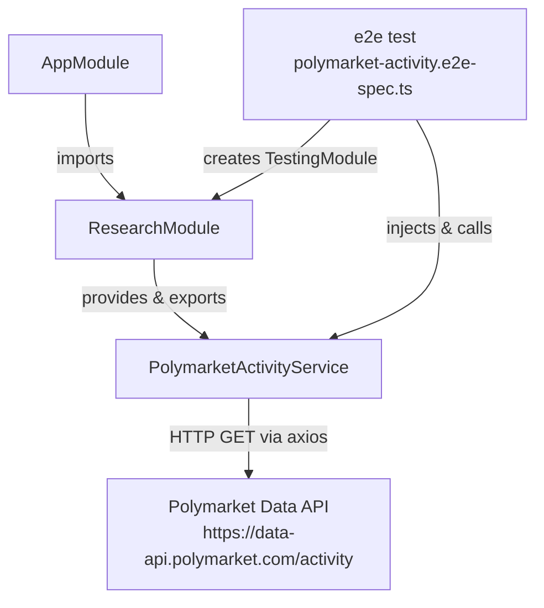
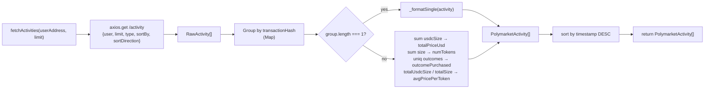

# Polymarket Activity Service Design Document

## Overview

Port the Python Polymarket activity tracker (`research/polymarket_activity_tracker.py`) to a NestJS injectable service under `src/research/`. The service fetches raw trade records from the Polymarket Data API, groups them by transaction hash, aggregates multi-fill trades into single logical records, and returns the result sorted by timestamp descending. This is a POC — stateless, no persistence, no deduplication between calls.

## Design Summary (Meta)

```yaml
design_type: "new_feature"
risk_level: "low"
complexity_level: "low"
complexity_rationale: "Single HTTP call + in-memory grouping/aggregation. No state, no concurrency coordination, no external storage. Complexity is well-bounded."
main_constraints:
  - "POC — no overengineering; one service file, one module file"
  - "Stateless: no deduplication or persistence between calls"
  - "HTTP client: axios (new runtime dependency)"
  - "Integration test hits the live Polymarket API with a known address"
biggest_risks:
  - "Live API in integration test makes test non-deterministic if the address has no history (mitigated: address is known-active)"
  - "axios not yet in package.json — install must precede build"
unknowns:
  - "Whether @types/axios is needed separately (axios >=1.x ships its own types)"
```

## Background and Context

### Prerequisite ADRs

No existing ADRs are present in this repository. No common ADRs are applicable to this POC scope.

### Agreement Checklist

#### Scope
- [x] Create `src/research/polymarket-activity.service.ts` — stateless fetch + aggregate
- [x] Create `src/research/polymarket-activity.module.ts` — NestJS module wrapper
- [x] Modify `src/app.module.ts` — import `ResearchModule`
- [x] Create `test/polymarket-activity.e2e-spec.ts` — integration test against live API
- [x] Modify `package.json` — add `axios` as a runtime dependency

#### Non-Scope (Explicitly not changing)
- [x] No deduplication logic (stateless by design)
- [x] No caching, polling loops, or background workers
- [x] No REST controller or HTTP endpoint exposure
- [x] No state file or persistence
- [x] `app.controller.ts`, `app.service.ts`, `main.ts` — untouched beyond the module import
- [x] `fills` array (present in Python multi-record aggregate output, deliberately omitted from TypeScript output interface at POC stage)

#### Constraints
- [x] Parallel operation: Not applicable (new code only)
- [x] Backward compatibility: Existing `AppModule`/`AppController`/`AppService` behaviour must be preserved
- [x] Performance measurement: Not required for POC

#### Applicable Standards
- [x] Single quotes, trailing commas `[explicit]` — Source: `.prettierrc`
- [x] `@Injectable()` decorator on services `[explicit]` — Source: NestJS framework convention, observed in `src/app.service.ts`
- [x] `@Module()` decorator on modules `[explicit]` — Source: NestJS framework convention, observed in `src/app.module.ts`
- [x] `strictNullChecks`, `noImplicitAny` enabled `[explicit]` — Source: `tsconfig.json`
- [x] `emitDecoratorMetadata` + `experimentalDecorators` enabled `[explicit]` — Source: `tsconfig.json`
- [x] E2E tests live under `test/` with suffix `.e2e-spec.ts` `[explicit]` — Source: `test/jest-e2e.json` (`testRegex: ".e2e-spec.ts$"`)
- [x] Unit tests live under `src/` with suffix `.spec.ts` `[implicit]` — Evidence: `src/app.controller.spec.ts`, `package.json` jest config (`rootDir: src, testRegex: .*\.spec\.ts$`)
- [x] Imports use `.js` extension for ESM resolution `[implicit]` — Evidence: `tsconfig.json` `module: nodenext`, NestJS scaffold pattern does NOT use `.js` extensions in decorator-based files; standard NestJS ts-jest setup resolves without them — confirmed no extension in existing files

### Alternative Solutions Considered

#### Option A: NestJS HttpModule / HttpService instead of raw axios

NestJS ships `@nestjs/axios`, which wraps axios in an injectable service and integrates with the NestJS module system. This is the idiomatic choice for production NestJS HTTP calls.

**Rejected reason**: For a POC with a single external target and no need to override interceptors, swap transports, or test the HTTP layer in isolation, the additional boilerplate (`HttpModule.register()`, constructor injection, converting Observables/Promises) adds surface area without benefit. Raw `axios.get` is two lines and keeps the service self-contained.

**Trade-off note**: Because axios is not injected, the HTTP fetch layer cannot be unit-tested without a module-level mock. This is acceptable at POC stage; if the service is promoted to production, `HttpService` injection should be adopted at that time.

**ADR note**: Introducing axios as a new runtime dependency would normally trigger an ADR under the documentation-criteria external-dependency rule. This is waived for POC scope. If axios (or `@nestjs/axios`) is retained in production, an ADR should be created before the service leaves POC status.

#### Option B: Co-locate logic in AppModule / AppService instead of a dedicated ResearchModule

All logic could be added directly to `AppService` with no new module, keeping the file count at zero net additions.

**Rejected reason**: This violates the NestJS convention of one bounded context per module. The `research` domain is semantically distinct from the application root. Creating a `ResearchModule` follows the same pattern as every other NestJS feature module and makes future additions (controller, caching, second service) straightforward without touching the root module structure.

### Problem to Solve

The Python research script proves the Polymarket API integration works and establishes the aggregation algorithm. The next step is to bring that logic into the NestJS application so it can be used by future features (notifications, analysis endpoints) through standard NestJS dependency injection.

### Current Challenges

- The Python script mixes fetch, aggregate, state management, and display into one class. The NestJS port scopes to fetch + aggregate only (stateless).
- `axios` is not yet a project dependency; it must be added before the build succeeds.
- The `src/research/` directory exists but is empty — no existing NestJS patterns to reuse within it.

### Requirements

#### Functional Requirements

- FR-1: `PolymarketActivityService.fetchActivities(userAddress, limit?)` calls `GET https://data-api.polymarket.com/activity` with params `user`, `limit`, `type=TRADE`, `sortBy=TIMESTAMP`, `sortDirection=DESC`
- FR-2: Raw records are grouped by `transactionHash`; fallback key is `unknown_<timestamp>` when the field is absent
- FR-3: Single-record groups are formatted as-is; multi-record groups have `usdcSize` summed (`totalPriceUsd`), `size` summed (`numTokens`), unique outcomes collected and comma-joined, and average price calculated as `totalUsdcSize / totalSize`
- FR-4: All records are sorted by `timestamp` descending before return
- FR-5: Output per activity conforms to the `PolymarketActivity` interface (see Contract Definitions)
- FR-6: The service is registered in a NestJS module and injectable via DI
- FR-7: `limit` defaults to 100; maximum accepted by the API is 500

#### Non-Functional Requirements

- **Reliability**: HTTP errors from axios propagate as thrown exceptions (no silent swallowing)
- **Maintainability**: Pure data-transformation logic is separated from HTTP-fetch logic within the service via private methods, matching the Python class structure

## Acceptance Criteria (AC) — EARS Format

### FR-1: API Fetch

- [ ] **When** `fetchActivities` is called with a valid Ethereum address, the system shall issue `GET https://data-api.polymarket.com/activity` with query params `user=<address lowercased>`, `limit=<limit>`, `type=TRADE`, `sortBy=TIMESTAMP`, `sortDirection=DESC`
- [ ] **When** `limit` is not provided, the system shall default to `100`
- [ ] **If** the HTTP response status is non-2xx, **then** the system shall propagate the axios error without wrapping it in a default value

### FR-2 / FR-3: Aggregation

- [ ] **When** multiple raw records share the same `transactionHash`, the system shall return a single aggregated activity with `totalPriceUsd` equal to the sum of all `usdcSize` values, `numTokens` equal to the sum of all `size` values, and `outcomePurchased` as a comma-separated string of unique outcomes
- [ ] **When** a raw record has no `transactionHash`, the system shall group it under key `unknown_<timestamp>`
- [ ] **When** a `transactionHash` group contains exactly one record, the system shall use `price` directly as `avgPricePerToken` (no re-calculation)
- [ ] **When** a `transactionHash` group contains multiple records, the system shall calculate `avgPricePerToken` as `round(totalUsdcSize / totalSize, 4)` (or `0` when `totalSize` is `0`)

### FR-4: Sort Order

- [ ] The system shall return activities sorted by `timestamp` descending (most recent first)
- [ ] When `timestamp` is absent or undefined on a record, the system shall treat it as `0` for sort purposes (records with a missing timestamp appear last in descending order)

### FR-5: Output Shape

- [ ] Each returned activity shall have `transactionHash` (string), `date` (human-readable string from Unix timestamp), `eventTitle` (string), `eventLink` (string prefixed `https://polymarket.com/event/`), `marketSlug` (string), `outcomePurchased` (string), `side` (string — typically `BUY` or `SELL`, may be `N/A` when the API omits the field), `totalPriceUsd` (number, 2dp), `numTokens` (number, 2dp), `avgPricePerToken` (number, 4dp), `activityCount` (number)
- [ ] **If** `eventSlug` is absent in the raw record, **then** `eventLink` shall be `N/A`
- [ ] **If** `timestamp` is absent in the raw record, **then** `date` shall be `N/A`

### FR-6: DI Integration

- [ ] `PolymarketActivityService` shall be injectable via NestJS DI when `ResearchModule` is imported
- [ ] `AppModule` shall import `ResearchModule` and the application shall start without error

### Integration Test

- [ ] **When** `fetchActivities('0x2005d16a84ceefa912d4e380cd32e7ff827875ea', 50)` is called in the e2e test, the system shall return a non-empty array
- [ ] Each item in the returned array shall have all of the following fields present and non-null/undefined: `transactionHash`, `eventTitle`, `side`, `totalPriceUsd`, `numTokens`, `outcomePurchased`, `date`, `eventLink`

## Existing Codebase Analysis

### Implementation Path Mapping

| Type | Path | Description |
|------|------|-------------|
| Existing | `src/app.module.ts` | Root NestJS module — will be modified to import `ResearchModule` |
| Existing | `src/app.service.ts` | Pattern reference: `@Injectable()` on a class with no constructor params |
| Existing | `src/app.controller.ts` | Pattern reference: constructor DI, `@Controller()` decorator |
| Existing | `test/app.e2e-spec.ts` | Pattern reference: e2e test structure using `@nestjs/testing` + `supertest` |
| Existing | `test/jest-e2e.json` | E2E jest config — test files must match `.e2e-spec.ts$` |
| Existing | `research/polymarket_activity_tracker.py` | Reference implementation: API params, grouping key, aggregation algorithm, output field names |
| New | `src/research/polymarket-activity.service.ts` | NestJS service (fetch + aggregate) |
| New | `src/research/polymarket-activity.module.ts` | NestJS module that exports the service |
| New | `test/polymarket-activity.e2e-spec.ts` | Integration test against live API |

### Integration Points

- **Integration Target**: `src/app.module.ts` — `imports` array
- **Invocation Method**: `ResearchModule` imported into `AppModule`; `PolymarketActivityService` available via NestJS DI container to any module that imports `ResearchModule`

### Similar Functionality Search

Searched for existing HTTP client usage, service patterns, and module patterns across `src/`:

- No existing HTTP client calls found in `src/` (only `app.service.ts` returns a hardcoded string)
- No existing `research` module code found (`src/research/` is empty)
- No duplicate implementation risk

Decision: **New implementation** — no similar functionality exists; proceed following existing NestJS patterns observed in `app.service.ts` and `app.module.ts`.

### Code Inspection Evidence

| File | Relevance |
|------|-----------|
| `src/app.service.ts:AppService` | Pattern reference: `@Injectable()` decorator, class structure |
| `src/app.module.ts:AppModule` | Integration point: where `ResearchModule` import will be added; pattern for `@Module()` |
| `src/app.controller.ts:AppController` | Pattern reference: constructor injection of service |
| `test/app.e2e-spec.ts` | Pattern reference: `Test.createTestingModule`, `app.init()`, `supertest` teardown |
| `test/jest-e2e.json` | Constraint: e2e test file naming and rootDir configuration |
| `research/polymarket_activity_tracker.py:fetch_activity` | Source of truth: API URL, query params |
| `research/polymarket_activity_tracker.py:aggregate_activities` | Source of truth: grouping key, sum/collect/average logic |
| `research/polymarket_activity_tracker.py:_format_activity` | Source of truth: single-record output field mapping |
| `research/polymarket_activity_tracker.py:_format_timestamp` | Source of truth: Unix timestamp → readable date |
| `research/polymarket_activity_tracker.py:_construct_event_link` | Source of truth: `https://polymarket.com/event/{slug}` |

## Design

### Change Impact Map

```yaml
Change Target: Add PolymarketActivityService + ResearchModule

Direct Impact:
  - src/app.module.ts (add ResearchModule to imports array)
  - src/research/polymarket-activity.service.ts (new file)
  - src/research/polymarket-activity.module.ts (new file)
  - test/polymarket-activity.e2e-spec.ts (new file)
  - package.json (add axios to dependencies)

Indirect Impact:
  - yarn.lock (updated by yarn after axios install)
  - dist/ (rebuilt output includes new files)

No Ripple Effect:
  - src/app.controller.ts (not modified)
  - src/app.service.ts (not modified)
  - src/main.ts (not modified)
  - test/app.e2e-spec.ts (not modified; existing e2e still passes)
  - All existing unit tests in src/ (no shared state, no shared types changed)
```

### Architecture Overview



### Data Flow



### Integration Points List

| Integration Point | Location | Old Implementation | New Implementation | Switching Method |
|---|---|---|---|---|
| AppModule imports | `src/app.module.ts` line 5 | `imports: []` | `imports: [ResearchModule]` | Direct code edit |
| ResearchModule declaration | `src/research/polymarket-activity.module.ts` | N/A (new) | `@Module({ providers: [PolymarketActivityService], exports: [PolymarketActivityService] })` | New file |
| axios HTTP call | `polymarket-activity.service.ts` | N/A | `axios.get<RawActivity[]>(...)` | New file; no DI abstraction needed for POC |

### Integration Point Map (Impact Classification)

```yaml
Integration Point 1:
  Existing Component: src/app.module.ts, AppModule.imports[]
  Integration Method: Import addition
  Impact Level: Low (read-only module wiring; existing AppModule behaviour preserved)
  Required Test Coverage: Existing app.e2e-spec.ts continues passing

Integration Point 2:
  Existing Component: NestJS DI container
  Integration Method: ResearchModule registered with providers + exports
  Impact Level: Low (additive only; no existing providers modified)
  Required Test Coverage: E2E test verifies PolymarketActivityService is resolvable and callable
```

### Main Components

#### PolymarketActivityService

- **Responsibility**: Fetch raw trade records from the Polymarket Data API; group and aggregate by transaction hash; return typed, sorted result array. No state between calls.
- **Interface**:
  ```typescript
  fetchActivities(userAddress: string, limit?: number): Promise<PolymarketActivity[]>
  ```
- **Dependencies**: `axios` (direct import, not injected — appropriate for a POC with a single HTTP target). Because axios is not injected, the HTTP fetch layer cannot be unit-tested without a module-level mock. Acceptable at POC stage. See "Alternative Solutions Considered" for full rationale and ADR waiver note.

#### ResearchModule

- **Responsibility**: NestJS module boundary for the `research` domain. Declares and exports `PolymarketActivityService`.
- **Interface**: `@Module` decorator; imported by `AppModule`
- **Dependencies**: `PolymarketActivityService`

### Data Representation Decision

New interfaces are required (`RawActivity`, `PolymarketActivity`). No existing TypeScript interfaces in the project overlap with these domain types.

| Criterion | Assessment | Reason |
|---|---|---|
| Semantic Fit | No | No existing activity/trade types in the codebase |
| Responsibility Fit | No | No existing bounded context for trading data |
| Lifecycle Fit | No | These are ephemeral per-call response types |
| Boundary/Interop Cost | N/A | No existing boundary to cross |

**Decision**: New structures — no overlapping types exist; new `interface RawActivity` and `interface PolymarketActivity` are justified.

### Contract Definitions

```typescript
/** Shape of a single record returned by the Polymarket Data API */
interface RawActivity {
  transactionHash?: string;
  timestamp?: number;
  title?: string;
  eventSlug?: string;
  slug?: string;
  outcome?: string;
  side?: string;
  usdcSize?: number;
  size?: number;
  price?: number;
}

/** Aggregated, formatted activity returned by PolymarketActivityService */
interface PolymarketActivity {
  transactionHash: string;
  date: string;                // Human-readable local datetime or 'N/A'
  eventTitle: string;
  eventLink: string;           // 'https://polymarket.com/event/{slug}' or 'N/A'
  marketSlug: string;
  outcomePurchased: string;    // Comma-separated unique outcomes
  side: string;                // Typically 'BUY' or 'SELL'; may be 'N/A' when absent in API response
  totalPriceUsd: number;       // Rounded to 2dp
  numTokens: number;           // Rounded to 2dp
  avgPricePerToken: number;    // Rounded to 4dp
  activityCount: number;
}
```

### Data Contract

#### PolymarketActivityService.fetchActivities

```yaml
Input:
  userAddress: string — Ethereum address (0x-prefixed); lowercased before use
  limit: number (optional, default 100) — clamped to max 500 by the API
  Preconditions: userAddress must be a non-empty string; no format validation at POC stage

Output:
  Type: Promise<PolymarketActivity[]>
  Guarantees:
    - Array is always returned (never null/undefined)
    - Array may be empty if the API returns no records
    - Items are sorted by timestamp descending
    - All numeric fields are rounded to specified decimal places
  On Error: axios errors propagate as unhandled rejections (caller decides recovery)

Invariants:
  - No shared state written or read between calls
  - Input userAddress is lowercased before reaching the API
  - activityCount >= 1 for every returned item
```

### Field Propagation Map

| Field | Boundary | Status | Detail |
|---|---|---|---|
| `transactionHash` | RawActivity → PolymarketActivity | preserved | Used as grouping key; written as-is to output; `unknown_<timestamp>` when absent |
| `timestamp` | RawActivity → PolymarketActivity | transformed | Unix number → formatted date string via `new Date(ts * 1000).toLocaleString()` |
| `title` | RawActivity → PolymarketActivity.eventTitle | preserved | Defaults to `'Unknown Event'` when absent |
| `eventSlug` | RawActivity → PolymarketActivity.eventLink | transformed | Prefixed with `https://polymarket.com/event/`; `'N/A'` when absent |
| `slug` | RawActivity → PolymarketActivity.marketSlug | preserved | Defaults to `''` when absent |
| `outcome` | RawActivity → PolymarketActivity.outcomePurchased | transformed (multi) | Unique values collected; joined with `', '`. Defaults to `"Unknown"` when absent (single-record path), matching Python reference |
| `side` | RawActivity → PolymarketActivity.side | preserved | From first record of group; defaults to `'N/A'` when absent (broad `string`, not a union type — the API may return values other than `BUY`/`SELL`) |
| `usdcSize` | RawActivity → PolymarketActivity.totalPriceUsd | aggregated | Summed across group; rounded to 2dp |
| `size` | RawActivity → PolymarketActivity.numTokens | aggregated | Summed across group; rounded to 2dp |
| `price` | RawActivity → PolymarketActivity.avgPricePerToken | preserved (single) / computed (multi) | Single: raw `price` rounded to 4dp. Multi: `totalUsdcSize / totalSize` rounded to 4dp |

### Error Handling

- **HTTP errors**: axios throws on non-2xx status; the service does not catch — the error propagates to the caller. This follows the fail-fast principle appropriate for a POC.
- **Missing fields**: All optional raw fields have fallback values applied during formatting (empty string, `'N/A'`, `0`, `'Unknown Event'`) so the output type guarantee is always met.
- **Division by zero**: `avgPricePerToken` is set to `0` when `totalSize` is `0` in a multi-record group.

### Logging and Monitoring

Not applicable for this POC scope. No logging added to keep the service lean.

## Implementation Plan

### Implementation Approach

**Selected Approach**: Vertical Slice

**Selection Reason**: The feature has a single pipeline (fetch → aggregate → return) with no shared foundation components. Delivering the complete slice — interfaces, service logic, module wiring, and integration test — in one pass is the most direct path to a working, verifiable POC. There are no other features that depend on a shared layer being built first.

### Technical Dependencies and Implementation Order

1. **Add axios to `package.json` and install**
   - Technical Reason: Build fails without the dependency; must precede TypeScript compilation
   - Dependent Elements: `polymarket-activity.service.ts`

2. **Define TypeScript interfaces (`RawActivity`, `PolymarketActivity`)**
   - Technical Reason: TypeScript strict mode requires types before use; interfaces can be co-located in the service file for POC
   - Dependent Elements: Service implementation, integration test assertions

3. **Implement `PolymarketActivityService`**
   - Technical Reason: Core logic; module and test both depend on this
   - Prerequisites: axios installed, interfaces defined

4. **Implement `ResearchModule`**
   - Technical Reason: Required for DI wiring and `AppModule` import
   - Prerequisites: Service implemented

5. **Modify `AppModule`**
   - Technical Reason: Makes service available application-wide
   - Prerequisites: `ResearchModule` exists

6. **Write integration test**
   - Technical Reason: Validates the full pipeline end-to-end
   - Prerequisites: All above steps complete

### Integration Points — E2E Verification

**Integration Point 1: ResearchModule → AppModule**
- Components: `ResearchModule` → `AppModule.imports`
- Verification: Run `yarn test:e2e`; the existing `app.e2e-spec.ts` must still pass (no regression). New `polymarket-activity.e2e-spec.ts` must also pass.

**Integration Point 2: PolymarketActivityService → Polymarket Data API**
- Components: `fetchActivities()` → `axios.get` → `https://data-api.polymarket.com/activity`
- Verification: Integration test with address `0x2005d16a84ceefa912d4e380cd32e7ff827875ea` returns a non-empty array where every item satisfies the field-shape assertion.

## Test Strategy

### Basic Test Design Policy

Each acceptance criterion maps directly to an assertion in the integration test. The integration test is the primary quality gate for this POC — unit tests of the aggregation logic are out of scope per the feature spec.

### Integration Test Design

File: `test/polymarket-activity.e2e-spec.ts`

The test bootstraps only `ResearchModule` (not the full `AppModule`) to keep setup minimal and avoid network side-effects from other modules.

```typescript
// Structural sketch — not an implementation sample
describe('PolymarketActivityService (integration)', () => {
  let module: TestingModule;
  let service: PolymarketActivityService;
  let activities: PolymarketActivity[];

  beforeAll(async () => {
    module = await Test.createTestingModule({
      imports: [ResearchModule],
    }).compile();
    service = module.get(PolymarketActivityService);
    // Single API call shared across all assertions — avoids redundant network requests
    activities = await service.fetchActivities(
      '0x2005d16a84ceefa912d4e380cd32e7ff827875ea',
      50,
    );
  });

  afterAll(async () => {
    await module.close();
  });

  it('returns a non-empty array for the known test address', () => {
    expect(activities.length).toBeGreaterThan(0);
  });

  it('each item has all required fields present and non-null', () => {
    for (const item of activities) {
      expect(item.transactionHash).toBeDefined();
      expect(item.transactionHash).not.toBeNull();
      expect(item.eventTitle).toBeDefined();
      expect(item.eventTitle).not.toBeNull();
      expect(item.side).toBeDefined();
      expect(item.side).not.toBeNull();
      expect(item.totalPriceUsd).toBeDefined();
      expect(item.totalPriceUsd).not.toBeNull();
      expect(item.numTokens).toBeDefined();
      expect(item.numTokens).not.toBeNull();
      expect(item.outcomePurchased).toBeDefined();
      expect(item.outcomePurchased).not.toBeNull();
      expect(item.date).toBeDefined();
      expect(item.date).not.toBeNull();
      expect(item.eventLink).toBeDefined();
      expect(item.eventLink).not.toBeNull();
    }
  });
});
```

**Note on `toBeDefined` / `not.toBeNull` vs exact-value assertions**: The field-shape AC requires that fields are non-null/undefined, not that they equal specific values (which are non-deterministic from a live API). Both assertions together correctly enforce the "present and non-null/undefined" contract. Business-logic correctness (aggregation math, sort order) would require unit tests with fixture data, which are out of scope for this POC.

### AC Coverage Mapping

| Acceptance Criterion | Coverage Method | Notes |
|---|---|---|
| FR-1: API fetch with correct params | Manual verification | Non-deterministic from live API; verify via network inspection during development |
| FR-1: Default limit = 100 | Manual verification | Call without `limit` arg and inspect query params |
| FR-1: Non-2xx error propagates | Future unit test | Requires mocked axios; out of scope for POC |
| FR-2 / FR-3: Multi-fill aggregation | Future unit test | Requires fixture data with shared `transactionHash` |
| FR-2: Fallback key `unknown_<timestamp>` | Future unit test | Requires fixture record with no `transactionHash` |
| FR-3: Single-record group — direct price | Future unit test | Requires fixture data |
| FR-3: Multi-record group — computed avg | Future unit test | Requires fixture data |
| FR-4: Sort descending | Future unit test | Requires fixture data with known timestamps |
| FR-4: Missing timestamp treated as 0 | Future unit test | Requires fixture record without timestamp |
| FR-5: Output field shape (non-null) | Integration test | 8 of 11 fields covered by "each item" `it` block; `avgPricePerToken`, `activityCount`, and `marketSlug` are deterministically non-null for any real trade — include in assertions or flag as future unit test scope |
| FR-5: `eventLink` = `N/A` when no slug | Future unit test | Requires fixture record without `eventSlug` |
| FR-5: `date` = `N/A` when no timestamp | Future unit test | Requires fixture record without `timestamp` |
| FR-6: DI injectable via ResearchModule | Integration test | Covered by `module.get(PolymarketActivityService)` succeeding |
| FR-6: AppModule starts without error | Integration test | Covered by existing `app.e2e-spec.ts` regression run |
| Integration: non-empty result | Integration test | Covered by first `it` block |

### E2E / Regression

The existing `test/app.e2e-spec.ts` must continue to pass after `ResearchModule` is imported into `AppModule`, confirming no regression in the root module wiring.

## Security Considerations

- The user address from `fetchActivities` is lowercased and passed directly as a query parameter. It is not evaluated as code, written to a database, or used in a file path — injection risk is negligible.
- No secrets are required. The Polymarket Data API is a public endpoint.
- axios requests are HTTPS only (the API base URL is `https://data-api.polymarket.com`).

## Future Extensibility

- **Controller / HTTP endpoint**: Add a `PolymarketActivityController` to `ResearchModule` when an API endpoint is needed.
- **Caching**: Wrap `fetchActivities` with an in-memory cache (e.g., NestJS `CacheModule`) keyed on `userAddress + limit`.
- **Deduplication**: Inject a persistence service and re-introduce the `filter_new_activities` logic from the Python script.
- **Configurable base URL**: Extract `https://data-api.polymarket.com` to a `ConfigService`-provided value for environment overrides.

## Risks and Mitigation

| Risk | Impact | Probability | Mitigation |
|---|---|---|---|
| Live API in integration test is flaky / rate-limited | Medium | Low | Test uses a known-active address with up to 50 records; failure is surfaced clearly. Acceptable for POC. |
| axios version incompatibility with NestJS 11 / Node 22 | Low | Low | axios >=1.x is stable and widely used with NestJS; `@types/axios` not needed (bundled types) |
| `module: nodenext` requires explicit `.js` imports in some patterns | Low | Low | Existing NestJS scaffold files use no extensions and work correctly under ts-jest; same pattern applies here |

## References

- [Polymarket Data API — Activity endpoint](https://data-api.polymarket.com) — Base URL and endpoint used by the service
- [axios npm package](https://www.npmjs.com/package/axios) — HTTP client chosen per user decision
- [NestJS Modules documentation](https://docs.nestjs.com/modules) — Module declaration and exports pattern
- [NestJS Testing documentation](https://docs.nestjs.com/fundamentals/testing) — `Test.createTestingModule` pattern used in integration test
- [Python reference implementation](../research/polymarket_activity_tracker.py) — Source of truth for API params, aggregation algorithm, and output field definitions

## Update History

| Date | Version | Changes | Author |
|---|---|---|---|
| 2026-02-25 | 1.0 | Initial version | Claude (Design Doc) |
| 2026-02-25 | 1.1 | I001: Added "Alternative Solutions Considered" section (HttpModule and co-location options). I002: Changed `side` field to broad `string` with N/A fallback in AC, interface comment, and field propagation map. I003: Added missing-timestamp sort edge case to FR-4. I004: Added `not.toBeNull()` alongside `toBeDefined()` for all required field assertions. I005: Refactored integration test sketch to single `beforeAll` call with shared cached result. I006: Added AC coverage mapping table. I007/I008: Added axios unit-test trade-off note and ADR waiver note to component description and Alternative Solutions section. | Claude (Design Doc) |
| 2026-02-25 | 1.2 | I101: Field Propagation Map `outcome` row — added explicit single-record fallback: defaults to `"Unknown"` when absent, matching Python reference. I102: Integration test sketch — declared `module: TestingModule` in describe scope, assigned in `beforeAll`, added `afterAll(async () => { await module.close(); })`. I103: Non-Scope — added `fills` array note (present in Python output, deliberately omitted from TypeScript interface at POC stage). I104: AC Coverage table FR-5 row — noted 8 of 11 fields covered and flagged `avgPricePerToken`, `activityCount`, `marketSlug` as candidates for assertion or future unit test scope. | Claude (Design Doc) |
