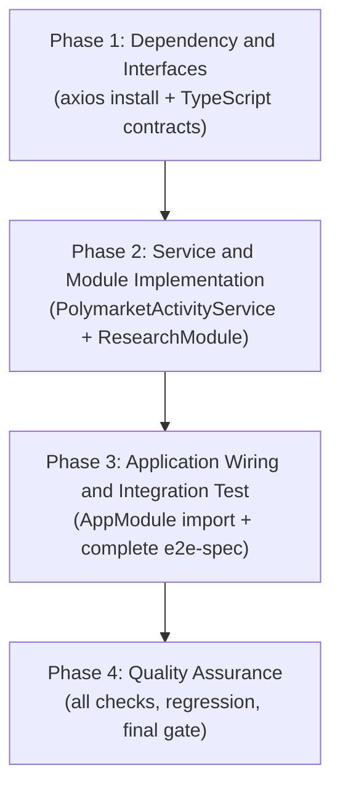
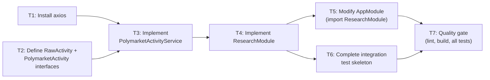

# Work Plan: Polymarket Activity Service Implementation

Created Date: 2026-02-25
Type: feature
Estimated Duration: 1 day
Estimated Impact: 5 files (2 new, 2 modified, 1 completed skeleton)
Related Issue/PR: N/A

## Related Documents

- Design Doc: [docs/design/polymarket-activity-service-design.md](../design/polymarket-activity-service-design.md)
- ADR: None (ADR waived for POC scope — see Design Doc "Alternative Solutions Considered")
- PRD: None

## Objective

Port the Python Polymarket activity tracker (`research/polymarket_activity_tracker.py`) to a NestJS injectable service under `src/research/`. The service fetches raw trade records from the Polymarket Data API, groups them by transaction hash, aggregates multi-fill trades into single logical records, and returns the result sorted by timestamp descending.

## Background

The Python research script proves the Polymarket API integration works. This work brings that logic into the NestJS application so future features (notifications, analysis endpoints) can consume it through standard NestJS dependency injection. The service is stateless — no persistence, no deduplication between calls.

## Risks and Countermeasures

### Technical Risks

- **Risk**: Live Polymarket Data API is flaky or rate-limited during integration test run
  - **Impact**: Medium — test non-determinism, CI noise
  - **Countermeasure**: Test uses a known-active address (`0x2005d16a84ceefa912d4e380cd32e7ff827875ea`) with `limit=50`. Failure is surfaced clearly. Acceptable for POC.

- **Risk**: axios version incompatibility with NestJS 11 / Node 22
  - **Impact**: Low — build failure before any logic is tested
  - **Countermeasure**: axios >=1.x is stable and widely used with NestJS 11; bundled types mean `@types/axios` is not needed. Verify with `yarn add axios` output before proceeding.

- **Risk**: `module: nodenext` in `tsconfig.json` requiring explicit `.js` import extensions
  - **Impact**: Low — import resolution failure at runtime
  - **Countermeasure**: Existing NestJS scaffold files use no extensions and work correctly under ts-jest. Follow the same pattern; confirm build succeeds before running tests.

### Schedule Risks

- **Risk**: Integration test depends on live network access in restricted environments
  - **Impact**: Low — test cannot pass offline
  - **Countermeasure**: Run `yarn test:e2e` only in environments with outbound HTTPS access. This is a POC constraint acknowledged in the Design Doc.

---

## Phase Structure Diagram



## Task Dependency Diagram



---

## Implementation Phases

### Phase 1: Dependency and Interfaces (Estimated commits: 1)

**Purpose**: Unblock the TypeScript build by adding axios and define the data contracts that all subsequent code depends on. No logic is implemented here — the output of this phase is a compilable codebase with the correct type surface.

#### Tasks

- [ ] **T1: Install axios runtime dependency**
  - Run `yarn add axios` in the project root
  - Confirm `package.json` `dependencies` contains `"axios": "<installed-version>"`
  - Confirm `yarn.lock` is updated
  - Completion criteria: `yarn build` succeeds (L3)

- [ ] **T2: Define `RawActivity` and `PolymarketActivity` interfaces in the service file stub**
  - Create `src/research/polymarket-activity.service.ts` with the two interfaces from the Design Doc Contract Definitions section
  - The file may export a stub class body at this point; the full implementation is Phase 2
  - Completion criteria: `yarn build` succeeds with the new file present (L3); interfaces match Design Doc exactly

#### Phase 1 Completion Criteria

- [ ] `axios` present in `package.json` `dependencies`
- [ ] `src/research/polymarket-activity.service.ts` exists with both interfaces defined
- [ ] `yarn build` exits zero

#### Operational Verification (Phase 1)

1. Run `yarn build` — expect zero errors
2. Inspect `package.json`: confirm `"axios"` key is in `dependencies` (not `devDependencies`)
3. Open `src/research/polymarket-activity.service.ts` and verify both interfaces are present with all fields matching the Design Doc

---

### Phase 2: Service and Module Implementation (Estimated commits: 2)

**Purpose**: Implement the full fetch-aggregate pipeline in `PolymarketActivityService` and wrap it in `ResearchModule`. This is the core logic delivery. The integration test skeleton already exists but cannot pass until this phase is complete.

#### Tasks

- [ ] **T3: Implement `PolymarketActivityService.fetchActivities` (with unit of logic verified manually)**
  - Implement the class in `src/research/polymarket-activity.service.ts`
  - Required logic (derived from Design Doc FR-1 through FR-5 and the field propagation map):
    - `fetchActivities(userAddress: string, limit = 100): Promise<PolymarketActivity[]>`
    - `axios.get` call with params: `user` (lowercased), `limit`, `type=TRADE`, `sortBy=TIMESTAMP`, `sortDirection=DESC`
    - Group raw records by `transactionHash`; fallback key `unknown_<timestamp>` when absent
    - Single-record groups: format directly (`price` rounded to 4dp as `avgPricePerToken`; `outcome ?? 'Unknown'`)
    - Multi-record groups: sum `usdcSize` → `totalPriceUsd` (2dp), sum `size` → `numTokens` (2dp), unique outcomes joined with `', '`, `totalUsdcSize / totalSize` rounded to 4dp as `avgPricePerToken` (guard `totalSize === 0` with result `0`)
    - `timestamp` → `new Date(ts * 1000).toLocaleString()` or `'N/A'` when absent
    - `eventSlug` → `'https://polymarket.com/event/' + slug` or `'N/A'` when absent
    - `side` from first record of group or `'N/A'`; `title ?? 'Unknown Event'`; `slug ?? ''`
    - Sort result by `timestamp` descending (missing timestamp treated as `0`)
    - `activityCount` = number of raw records in the group
  - Decorate with `@Injectable()`
  - Completion criteria: `yarn build` succeeds; manual trace of logic against Python reference implementation confirms field-level equivalence (L3)

- [ ] **T4: Implement `ResearchModule`**
  - Create `src/research/polymarket-activity.module.ts`
  - `@Module({ providers: [PolymarketActivityService], exports: [PolymarketActivityService] })`
  - Completion criteria: `yarn build` succeeds; module file exports `ResearchModule` (L3)

#### Phase 2 Completion Criteria

- [ ] `PolymarketActivityService` class is fully implemented and decorated with `@Injectable()`
  - All fields from `PolymarketActivity` interface are populated in all code paths
  - Division-by-zero guard on `avgPricePerToken` is present
  - HTTP errors propagate (no catch block around `axios.get`)
- [ ] `ResearchModule` exists with `providers` and `exports` containing `PolymarketActivityService`
- [ ] `yarn build` exits zero

#### Operational Verification (Phase 2)

1. Run `yarn build` — expect zero errors
2. Manually review `polymarket-activity.service.ts` against the Python file `research/polymarket_activity_tracker.py` for:
   - API URL and all five query parameters (`user`, `limit`, `type`, `sortBy`, `sortDirection`)
   - Grouping key logic (fallback `unknown_<timestamp>`)
   - Aggregation math (sum, unique, average, rounding)
   - All field defaults (`'N/A'`, `'Unknown Event'`, `''`, `0`, `'Unknown'`)
3. Confirm `ResearchModule` has both `providers` and `exports` containing `PolymarketActivityService`

---

### Phase 3: Application Wiring and Integration Test (Estimated commits: 2)

**Purpose**: Wire `ResearchModule` into `AppModule` so the service is available application-wide, then fill in the integration test skeleton and run it against the live API. This phase delivers the first end-to-end verified state.

#### Tasks

- [ ] **T5: Modify `src/app.module.ts` to import `ResearchModule`**
  - Add `ResearchModule` to the `imports` array
  - Add the corresponding import statement at the top of the file
  - Completion criteria: `yarn build` succeeds; `yarn test:e2e` runs `app.e2e-spec.ts` without regression (L1/L3)

- [ ] **T6: Complete `test/polymarket-activity.e2e-spec.ts`**
  - The skeleton at `test/polymarket-activity.e2e-spec.ts` already has the full test structure and all three `it` blocks
  - Verify the skeleton imports resolve (`PolymarketActivityService` from `../src/research/polymarket-activity.service`, `ResearchModule` from `../src/research/polymarket-activity.module`)
  - Confirm `beforeAll` / `afterAll` lifecycle hooks are correct (module bootstrap and teardown)
  - The test is already complete as written in the skeleton; the task is to confirm it compiles and the assertions match Design Doc AC exactly:
    - `activities.length > 0` — Integration Test AC (non-empty result)
    - All 11 fields `toBeDefined()` and `not.toBeNull()` — FR-5 field-shape AC
    - `activities.length <= 50` — limit boundary confirmation
  - Run `yarn test:e2e` and confirm all three test cases pass
  - Completion criteria: `yarn test:e2e` exits zero with 3 passing tests in `polymarket-activity.e2e-spec.ts` (L1/L2)

#### Phase 3 Completion Criteria

- [ ] `src/app.module.ts` `imports` array contains `ResearchModule`
- [ ] `yarn test:e2e` passes — both `app.e2e-spec.ts` (regression) and `polymarket-activity.e2e-spec.ts` (3 new tests) exit green
- [ ] Integration test result: non-empty array returned for address `0x2005d16a84ceefa912d4e380cd32e7ff827875ea` with `limit=50`
- [ ] All 11 `PolymarketActivity` fields verified as defined and non-null on every returned item

#### Operational Verification (Phase 3)

Integration Point 1: ResearchModule → AppModule (from Design Doc)
1. Run `yarn test:e2e` — both e2e spec files must pass with zero failures
2. Confirm no output from `app.e2e-spec.ts` changed (no regression in root module behaviour)

Integration Point 2: PolymarketActivityService → Polymarket Data API (from Design Doc)
1. `polymarket-activity.e2e-spec.ts` "returns a non-empty array" test passes — confirms live API reachable and fetch pipeline functional
2. "each item has all required fields present and non-null" test passes — confirms aggregation and formatting correctness for real data
3. "returns at most the requested limit of activities" test passes — confirms `limit` parameter propagates to the API correctly

---

### Phase 4: Quality Assurance (Estimated commits: 1)

**Purpose**: Final quality gate. Confirm the full test suite is green, the build is clean, linting and formatting pass, and every Design Doc acceptance criterion is either covered by the integration test or explicitly acknowledged as out-of-scope for POC (per AC Coverage Mapping table in Design Doc).

#### Tasks

- [ ] **Static analysis: run lint and format check**
  - `yarn lint` — expect zero errors
  - `yarn format` — auto-fix any formatting deviations, then confirm no unstaged changes remain that indicate a problem

- [ ] **Build verification**
  - `yarn build` — expect zero TypeScript compilation errors

- [ ] **Full test suite**
  - `yarn test` — unit test suite (existing `app.controller.spec.ts` must still pass)
  - `yarn test:e2e` — integration test suite (both spec files must pass)

- [ ] **Design Doc AC coverage review**
  - Walk through every AC in the Design Doc and confirm:
    - Covered by integration test: non-empty result, field-shape (11 fields), limit boundary, DI injectability (`module.get` success), AppModule regression
    - Acknowledged as future unit test scope (not a gap in this plan): FR-1 param verification, FR-2/FR-3 aggregation math with fixtures, FR-4 sort order with fixtures, FR-5 N/A edge cases
  - No AC marked as "covered" unless a passing test exists

- [ ] **Skill fidelity verification**
  - Confirm all implemented code follows NestJS conventions: `@Injectable()` on service, `@Module()` on module, single quotes, trailing commas per `.prettierrc`
  - Confirm no secrets in any committed file
  - Confirm axios HTTP call uses HTTPS URL only
  - Confirm `src/app.controller.ts`, `src/app.service.ts`, `src/main.ts` are unmodified

#### Phase 4 Completion Criteria

- [ ] `yarn lint` exits zero
- [ ] `yarn build` exits zero
- [ ] `yarn test` exits zero (unit tests)
- [ ] `yarn test:e2e` exits zero (integration tests — 3 tests in new spec + existing app spec)
- [ ] Design Doc AC coverage confirmed (no unacknowledged gaps)
- [ ] No secrets or hardcoded credentials in any file
- [ ] Existing files not in scope remain unmodified

#### Operational Verification (Phase 4)

1. Run the full verification sequence in order:
   ```
   yarn lint
   yarn build
   yarn test
   yarn test:e2e
   ```
2. All four commands must exit zero
3. Confirm `test/polymarket-activity.e2e-spec.ts` reports exactly 3 passing tests
4. Confirm `test/app.e2e-spec.ts` reports the same number of passing tests as before this work (no regression)

---

## Overall Completion Criteria

- [ ] All four phases completed with checkboxes checked
- [ ] Each phase's operational verification procedures executed and passed
- [ ] Design Doc acceptance criteria satisfied (integration test AC) or explicitly deferred (future unit test AC)
- [ ] `yarn lint`, `yarn build`, `yarn test`, `yarn test:e2e` all exit zero
- [ ] No secrets committed; all sensitive config via env vars if applicable (no secrets needed for this feature — Polymarket API is public)
- [ ] Files outside the declared scope are unmodified
- [ ] User review approval obtained

---

## Progress Tracking

### Phase 1: Dependency and Interfaces

- Start: —
- Complete: —
- Notes:

### Phase 2: Service and Module Implementation

- Start: —
- Complete: —
- Notes:

### Phase 3: Application Wiring and Integration Test

- Start: —
- Complete: —
- Notes:

### Phase 4: Quality Assurance

- Start: —
- Complete: —
- Notes:

---

## Notes

- The integration test skeleton at `test/polymarket-activity.e2e-spec.ts` is already written and complete. T6 is a verification and run task, not a writing task.
- Unit tests for aggregation logic (grouping math, sort order, N/A fallbacks) are out of scope for this POC. They are listed as "future unit test scope" in the Design Doc AC Coverage Mapping table.
- axios is added as a runtime dependency (`dependencies`, not `devDependencies`) because it is used in service code that runs in production, not only in tests.
- `@types/axios` is not needed; axios >=1.x ships its own TypeScript types.
- If `yarn add axios` installs a version below 1.0, escalate — that would be unexpected and may indicate a resolution conflict.
- The `fills` array from the Python output is deliberately omitted from the TypeScript `PolymarketActivity` interface at POC stage (documented in Design Doc Non-Scope).
