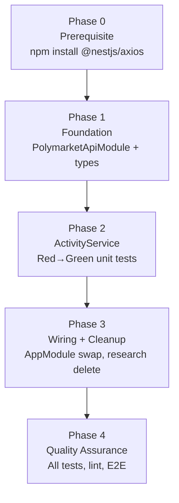
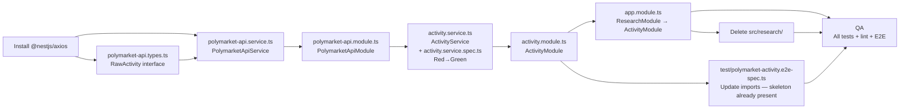

# Work Plan: Activity Module — POC to Production Promotion

Created Date: 2026-02-26
Type: refactor
Estimated Duration: 1 day
Estimated Impact: 11 files (3 new, 2 modified, 2 deleted, 1 updated, 1 verified, 1 dependency install, 1 new unit spec)
Related Issue/PR: N/A

## Related Documents

- Design Doc: `docs/design/20260226-activity-module-production.md`
- ADR: `docs/adr/20260226-polymarket-activity-production-architecture.md`
- PRD: `docs/prd/20260226-activity-module-production.md`

## Objective

Promote the Polymarket activity service from the POC in `src/research/` into two production-ready NestJS modules (`PolymarketApiModule` and `ActivityModule`) with an injectable HTTP layer, full unit test coverage for all aggregation logic, and an improved two-pass aggregation pipeline that eliminates cross-transaction duplicate records before they reach consumers.

## Background

The POC service (`src/research/polymarket-activity.service.ts`) uses raw `axios.get()` directly, has no unit tests, and mixes HTTP transport with business logic in a single service. This blocks safe consumption by future modules. The `formatSingle`/`aggregateGroup` split must be unified into a single `formatGroup` function, and a second grouping pass must be added to merge records sharing the same composite key `(timestamp, marketSlug, outcomePurchased, side)` across different transaction hashes.

## Skill Constraints

- `PolymarketApiService` must use injected `HttpService` — raw `axios` import is prohibited in business logic
- `ActivityService` depends on `PolymarketApiService` via DI only — no direct instantiation
- `formatGroup` is the single unified function (no `formatSingle`/`aggregateGroup` split)
- `outcomePurchased` in multi-record groups: unique outcomes sorted alphabetically, joined with `', '`
- `JSON.stringify([timestamp, marketSlug, outcomePurchased, side])` is the composite key for pass 2
- TypeScript strict mode (`strictNullChecks`, `noImplicitAny`) applies to all new files
- Each commit must pass quality-fixer approval before it is made

## Risks and Countermeasures

### Technical Risks

- **Risk**: `firstValueFrom(observable)` is a new pattern in this codebase — Observable-to-Promise conversion may be misconfigured
  - **Impact**: Medium — `PolymarketApiService` calls silently hang or throw at runtime
  - **Countermeasure**: Apply the idiomatic NestJS pattern from the ADR exactly: `firstValueFrom(this.httpService.get<RawActivity[]>(...))`. The unit tests for `ActivityService` will catch any wiring failure immediately because they mock `PolymarketApiService.getActivities` at the boundary.

- **Risk**: Numeric floating-point precision in aggregation (sum, avg) could cause assertion mismatches
  - **Impact**: Medium — unit test Scenario 2 (totalPriceUsd=15, avgPricePerToken=0.5) fails spuriously
  - **Countermeasure**: Use `parseFloat(...toFixed(N))` for all rounding operations, mirroring the existing POC implementation exactly. The test fixtures are chosen so that results are exact within floating-point representation.

- **Risk**: Intermediate pipeline state carries numeric `timestamp` between pass 1 and pass 2; premature `date` string formatting would break the composite key comparison
  - **Impact**: High — pass 2 silently fails to merge records because the timestamp key component is a string
  - **Countermeasure**: Design `ActivityService` internal intermediate type to carry both the raw `timestamp: number` and the partially assembled activity. Format the `date` string only after both passes complete. This is enforced by the unit test Scenario 3 (cross-transaction merge), which would produce `result.length === 2` instead of `1` if date formatting happens too early.

- **Risk**: `ResearchModule` deletion before `AppModule` swap leaves the app in a broken state during a mid-implementation state
  - **Impact**: Low — only affects intermediate commits, not the final state
  - **Countermeasure**: Implement in strict order: Phase 1 (foundation) → Phase 2 (ActivityService + unit tests, Red→Green) → Phase 3 (wiring + cleanup). The app must compile and `test/app.e2e-spec.ts` must pass after each phase's final commit.

### Schedule Risks

- **Risk**: Live Polymarket Data API unavailable or rate-limited during E2E execution
  - **Impact**: Low — E2E Suite 1 (live API) fails non-deterministically
  - **Countermeasure**: Known-active address with `limit=50` is well within rate limits. Acceptable for this scope per PRD. Suite 2 (fixture-based) is unaffected and will pass regardless of network state.

## Phase Structure Diagram

## Task Dependency Diagram

---

## Implementation Phases

### Phase 0: Prerequisite — Install @nestjs/axios (Estimated commits: 1)

**Purpose**: Install the `@nestjs/axios` package as an unconditional prerequisite. All subsequent phases depend on `HttpModule` and `HttpService` being resolvable. This is a single `npm install` commit with no source changes.

#### Tasks

- [ ] **T0**: Run `npm install @nestjs/axios` — installs `@nestjs/axios ^4.x`; verify `package.json` `dependencies` section now lists `@nestjs/axios`
- [ ] Quality check: `npm run build` succeeds (no source changes, but confirms package resolution)

#### Phase Completion Criteria

- [ ] `package.json` `dependencies` contains `@nestjs/axios`
- [ ] `npm run build` exits with code 0

#### Operational Verification

1. `cat package.json | grep @nestjs/axios` — confirms entry in `dependencies`
2. `npm run build` — confirms no installation-caused type errors

---

### Phase 1: Foundation — PolymarketApiModule (Estimated commits: 3)

**Purpose**: Establish the HTTP transport layer (`PolymarketApiModule`, `PolymarketApiService`, `RawActivity` types) before the business logic layer is built. `ActivityService` cannot be implemented until `PolymarketApiService` is injectable. This phase produces no changes to `AppModule` or the research module.

Implements: FR-1, FR-2, FR-3

#### Tasks

- [ ] **T1a**: Create `src/polymarket-api/polymarket-api.types.ts`
  - Define `RawActivity` interface with all 10 optional fields: `transactionHash`, `timestamp`, `title`, `eventSlug`, `slug`, `outcome`, `side`, `usdcSize`, `size`, `price`
  - Export `RawActivity`
  - Completion: TypeScript compiles; interface matches the 10 fields listed in FR-3 AC

- [ ] **T1b**: Create `src/polymarket-api/polymarket-api.service.ts`
  - `@Injectable()` class `PolymarketApiService`
  - Constructor injects `HttpService` from `@nestjs/axios` (private readonly)
  - `getActivities(userAddress: string, limit: number): Promise<RawActivity[]>`
    - Issues `GET https://data-api.polymarket.com/activity` with params `user`, `limit`, `type=TRADE`, `sortBy=TIMESTAMP`, `sortDirection=DESC`
    - `userAddress` is lowercased before use
    - Uses `firstValueFrom(this.httpService.get<RawActivity[]>(...))` — no manual `.subscribe()`
    - Returns `response.data` — no error wrapping
  - Completion: TypeScript strict-mode compiles with no errors; `getActivities` signature matches FR-2 AC

- [ ] **T1c**: Create `src/polymarket-api/polymarket-api.module.ts`
  - `@Module({ imports: [HttpModule], providers: [PolymarketApiService], exports: [PolymarketApiService] })`
  - `HttpModule` imported from `@nestjs/axios`
  - Completion: TypeScript strict-mode compiles; module imports/exports match FR-1 AC

- [ ] Quality check: `npm run lint`, `npm run build` — zero errors across all three new files

#### Phase Completion Criteria

- [ ] `src/polymarket-api/polymarket-api.types.ts` exports `RawActivity` with 10 optional fields (FR-3 AC)
- [ ] `src/polymarket-api/polymarket-api.service.ts` — `getActivities` uses `HttpService` via `firstValueFrom`, no raw `axios` import (FR-2 AC)
- [ ] `src/polymarket-api/polymarket-api.module.ts` exports `PolymarketApiService` (FR-1 AC)
- [ ] `npm run build` exits 0
- [ ] `npm run lint` exits 0

#### Operational Verification

1. `npm run build` — confirms the three new files compile cleanly under strict mode
2. Manual import check: confirm no `import axios from 'axios'` appears in `polymarket-api.service.ts`

---

### Phase 2: ActivityService — Red to Green (Estimated commits: 2)

**Purpose**: Implement `ActivityService` (two-pass aggregation pipeline) and simultaneously make the 6 Red unit tests in `src/activity/activity.service.spec.ts` pass (Green). Both files are committed together as one logical unit. Then create `ActivityModule` as a second commit.

Implements: FR-4, FR-5, FR-6, FR-7, FR-8, FR-11

**Strategy**: TDD — the test skeleton at `src/activity/activity.service.spec.ts` is already written (Red). Implementation must make all 6 scenarios Green without modifying the test assertions.

#### Unit Test Scenarios (all must reach Green)

| # | Scenario | AC Reference | Complexity |
|---|----------|-------------|------------|
| 1 | Single-record group output shape — all 11 fields at exact literal values | FR-5/FR-6 | medium |
| 2 | Multi-record group aggregation math — summed totals, alphabetically sorted outcomes | FR-5/FR-6 | medium |
| 3 | Cross-transaction merge when all four composite-key fields match | FR-7 | high |
| 4 | No merge when any composite-key field differs | FR-7 | medium |
| 5 | Descending timestamp sort order across 3+ fixtures | FR-8 | medium |
| 6 | Missing timestamp treated as 0 for sort, date='N/A' | FR-5/FR-8 | low |

Test case resolution target: **6/6** before Phase 2 commit.

#### Tasks

- [ ] **T2a**: Create `src/activity/activity.service.ts` — implement `ActivityService` making all 6 unit tests Green simultaneously

  **Implementation requirements (enforced by test assertions)**:
  - `@Injectable()` class `ActivityService`
  - Constructor injects `PolymarketApiService` (private readonly)
  - `fetchActivities(userAddress: string, limit = 100): Promise<PolymarketActivity[]>`
  - **Pass 1** — group by `transactionHash` (fallback key: `unknown_<timestamp ?? 0>`); call `formatGroup(records, key)` per group; produce intermediate array `Array<{ activity: PolymarketActivity; timestamp: number }>`
  - **`formatGroup(records: RawActivity[], key: string): PolymarketActivity`** — single unified function (no `formatSingle`/`aggregateGroup` split):
    - `transactionHash`: the `key` parameter
    - `totalPriceUsd`: `parseFloat(sum(usdcSize).toFixed(2))`
    - `numTokens`: `parseFloat(sum(size).toFixed(2))`
    - `avgPricePerToken`: single record → `parseFloat((price ?? 0).toFixed(4))`; multiple records → `parseFloat((totalPriceUsd / totalSize === 0 ? 0 : totalPriceUsd / totalSize).toFixed(4))`
    - `outcomePurchased`: `[...new Set(records.map(r => r.outcome ?? 'Unknown'))].sort().join(', ')`
    - `date`: `timestamp ? new Date(timestamp * 1000).toLocaleString() : 'N/A'` (using first record's timestamp)
    - `eventTitle`: `first.title ?? 'Unknown Event'`
    - `eventLink`: `first.eventSlug ? 'https://polymarket.com/event/' + first.eventSlug : 'N/A'`
    - `marketSlug`: `first.slug ?? ''`
    - `side`: `first.side ?? 'N/A'`
    - `activityCount`: `records.length`
  - **Pass 2** — group intermediate array by `JSON.stringify([numericTimestamp, activity.marketSlug, activity.outcomePurchased, activity.side])`:
    - For each merged group: sum `totalPriceUsd`, sum `numTokens`, sum `activityCount`, recompute `avgPricePerToken = parseFloat((mergedTotalPriceUsd / mergedNumTokens).toFixed(4))` (or 0 if denominator is 0), preserve `transactionHash` from the first record in group
    - Keep numeric `timestamp` on intermediate state through both passes; do NOT format `date` until after pass 2
  - **Sort** by numeric `timestamp` descending after pass 2; then map to `PolymarketActivity[]` with `date` formatted at this point
  - Completion: `npm test -- activity.service.spec` exits 0, all 6 scenarios pass

- [ ] **T2b**: Create `src/activity/activity.module.ts`
  - `@Module({ imports: [PolymarketApiModule], providers: [ActivityService], exports: [ActivityService] })`
  - Completion: TypeScript strict-mode compiles; `AppModule` can import it in Phase 3 without error

- [ ] Quality check: `npm run lint`, `npm run build`, `npm test -- activity.service.spec` — all exit 0

#### Phase Completion Criteria

- [ ] `src/activity/activity.service.ts` — `ActivityService` implemented with two-pass pipeline and unified `formatGroup`
- [ ] `npm test -- activity.service.spec` — 6/6 scenarios Green, 0 failures
- [ ] `src/activity/activity.module.ts` — `ActivityModule` imports `PolymarketApiModule`, exports `ActivityService` (FR-4 AC)
- [ ] `npm run build` exits 0
- [ ] `npm run lint` exits 0

#### Operational Verification

1. `npm test -- activity.service.spec` — confirm output shows `6 passed, 0 failed`
2. Check that `activity.service.ts` contains no `import axios from 'axios'`
3. Check that `activity.service.ts` contains no direct `new PolymarketApiService()` instantiation

---

### Phase 3: Wiring + Cleanup (Estimated commits: 3)

**Purpose**: Wire `ActivityModule` into `AppModule`, delete the `src/research/` POC directory, and confirm the E2E test skeleton (`test/polymarket-activity.e2e-spec.ts`) integrates cleanly with the new module. Each sub-task is a separate commit. `test/app.e2e-spec.ts` must pass after each commit.

Implements: FR-9, FR-10, FR-12

#### Tasks

- [ ] **T3a**: Modify `src/app.module.ts` — swap `ResearchModule` import for `ActivityModule`
  - Replace `import { ResearchModule } from './research/polymarket-activity.module'` with `import { ActivityModule } from './activity/activity.module'`
  - Replace `ResearchModule` in the `imports` array with `ActivityModule`
  - Do NOT delete `src/research/` in this commit (keep `ResearchModule` deletable as a clean separate commit)
  - Completion: `npm run build` exits 0; `npm run test:e2e -- app` exits 0 (FR-9 AC)

- [ ] **T3b**: Delete `src/research/polymarket-activity.service.ts` and `src/research/polymarket-activity.module.ts`
  - Confirm no remaining `import` in any source or test file references `src/research/`
  - Completion: `find src/research -type f` returns empty; `grep -r "src/research" src/ test/` returns no matches (FR-10 AC)

- [ ] **T3c**: Verify `test/polymarket-activity.e2e-spec.ts` — the skeleton already uses `ActivityModule` and `ActivityService` imports; confirm no edits are needed to make it point to the new modules (the file was pre-generated with the correct import paths)
  - If any import path requires adjustment (e.g., path typo), fix it in this commit
  - Completion: `npm run test:e2e -- polymarket` exits 0 (Suite 1 live API + Suite 2 fixture-based both pass)

- [ ] Quality check: `npm run lint`, `npm run build`, `npm test`, `npm run test:e2e` — all exit 0

#### Phase Completion Criteria

- [ ] `src/app.module.ts` imports `ActivityModule` only — no `ResearchModule` reference remains (FR-9 AC)
- [ ] `find src/research -type f` returns empty output (FR-10 AC)
- [ ] `grep -r "research" src/ test/` returns no matches
- [ ] `npm run test:e2e -- app` exits 0 — `GET /` returns `200 "Hello World!"` (FR-9 AC)
- [ ] `npm run test:e2e -- polymarket` exits 0 — both e2e suites pass (FR-12 AC)
- [ ] `npm run build` exits 0
- [ ] `npm run lint` exits 0

#### Operational Verification

1. `npm run test:e2e -- app` — output shows `GET / → 200 Hello World!` still passing
2. `npm run test:e2e -- polymarket` — output shows `ActivityService (live API integration)` and `ActivityService (fixture-based cross-transaction merge)` both passing
3. `grep -r "ResearchModule\|polymarket-activity.module\|polymarket-activity.service" src/ test/` — must return no matches

---

### Phase 4: Quality Assurance (Estimated commits: 1)

**Purpose**: Verify all Design Doc acceptance criteria are met, all tests pass (unit + e2e), lint and type checks are clean, and the final state is coherent.

#### Tasks

- [ ] Run full unit test suite: `npm test` — 0 failures
- [ ] Run full e2e suite: `npm run test:e2e` — 0 failures (includes `app.e2e-spec.ts` and `polymarket-activity.e2e-spec.ts`)
- [ ] Run lint: `npm run lint` — 0 errors
- [ ] Run build: `npm run build` — exits 0
- [ ] Verify all 12 FR acceptance criteria against final codebase (see checklist below)
- [ ] Confirm `src/research/` directory is absent
- [ ] Confirm no import of `src/research/` anywhere
- [ ] Confirm `test/polymarket-activity.e2e-spec.ts` imports only `ActivityModule` and `ActivityService`

#### Design Doc AC Verification Checklist

- [ ] FR-1: `Test.createTestingModule({ imports: [ActivityModule] })` resolves `ActivityService` without error
- [ ] FR-2: `PolymarketApiService.getActivities` uses `HttpService` via `firstValueFrom`; no raw `axios` import
- [ ] FR-3: `RawActivity` has all 10 optional fields in `polymarket-api.types.ts`
- [ ] FR-4: `ActivityModule` imports `PolymarketApiModule`, exports `ActivityService`
- [ ] FR-5/FR-6: Scenario 1 — single-record output: all 11 fields at exact literal values (unit test Green)
- [ ] FR-5/FR-6: Scenario 2 — multi-record math: sum, alphabetical outcomes (unit test Green)
- [ ] FR-7: Scenario 3 — cross-transaction merge on matching composite key (unit test Green)
- [ ] FR-7: Scenario 4 — no merge on key field mismatch (unit test Green)
- [ ] FR-8: Scenario 5 — descending timestamp sort (unit test Green)
- [ ] FR-8: Scenario 6 — missing timestamp as 0, date='N/A' (unit test Green)
- [ ] FR-9: App starts; `test/app.e2e-spec.ts` passes
- [ ] FR-10: Zero files under `src/research/`; zero imports referencing `src/research/`
- [ ] FR-11: 6/6 unit test scenarios in `activity.service.spec.ts` pass
- [ ] FR-12: E2E Suite 1 (live API) and Suite 2 (fixture-based cross-tx merge) both pass

#### Phase Completion Criteria

- [ ] `npm test` — 0 failures, 6/6 `activity.service.spec.ts` scenarios pass
- [ ] `npm run test:e2e` — 0 failures across all e2e specs
- [ ] `npm run lint` — 0 errors
- [ ] `npm run build` — exits 0
- [ ] All 14 AC checklist items above verified

#### Operational Verification

1. `npm test` — confirm `Tests: X passed` with 0 failures and the ActivityService describe blocks are present
2. `npm run test:e2e` — confirm both `ActivityService (live API integration)` and `ActivityService (fixture-based cross-transaction merge)` appear in output with passing status
3. `npm run test:e2e` — confirm `AppController (e2e)` still passes
4. `find src/research -type f 2>/dev/null | wc -l` — must output `0`
5. `grep -r "ResearchModule\|PolymarketActivityService\|src/research" src/ test/ --include="*.ts"` — must return no matches

---

## Completion Criteria

- [ ] All phases (0 through 4) completed
- [ ] Each phase's operational verification procedures executed with passing results
- [ ] All 14 Design Doc acceptance criteria satisfied (FR-1 through FR-12)
- [ ] Unit tests: 6/6 scenarios in `src/activity/activity.service.spec.ts` pass
- [ ] E2E tests: Both suites in `test/polymarket-activity.e2e-spec.ts` pass
- [ ] `test/app.e2e-spec.ts` continues to pass without modification
- [ ] Zero files remain under `src/research/`
- [ ] Zero imports of `src/research/` remain anywhere in the codebase
- [ ] `npm run lint` exits 0
- [ ] `npm run build` exits 0
- [ ] User review approval obtained

## Progress Tracking

### Phase 0: Prerequisite
- Start: —
- Complete: —
- Notes:

### Phase 1: Foundation
- Start: —
- Complete: —
- Notes:

### Phase 2: ActivityService Red→Green
- Start: —
- Complete: —
- Notes:

### Phase 3: Wiring + Cleanup
- Start: —
- Complete: —
- Notes:

### Phase 4: Quality Assurance
- Start: —
- Complete: —
- Notes:

## Notes

### Implementation Constraints (from Design Doc)

- `PolymarketApiService` must NOT import `axios` directly — use `HttpService` from `@nestjs/axios` only
- `ActivityService` must NOT instantiate `PolymarketApiService` directly — constructor DI only
- `formatGroup` is the single function for both single-record and multi-record cases — no `formatSingle`/`aggregateGroup` divergence
- Numeric timestamp must remain accessible on intermediate state through both passes — `date` string formatting happens only after pass 2 sort is complete
- Composite key for pass 2: `JSON.stringify([numericTimestamp, marketSlug, outcomePurchased, side])` — no separator-based string concatenation
- `transactionHash` of merged record = first record's hash in input order
- `avgPricePerToken` in merged group = `mergedTotalPriceUsd / mergedNumTokens` rounded to 4dp (not an average of averages)

### Test File Status

- `src/activity/activity.service.spec.ts` — skeleton already present with 6 complete scenario implementations (Red state). Do not modify assertions. Implement `activity.service.ts` to make them Green.
- `test/polymarket-activity.e2e-spec.ts` — skeleton already present with correct `ActivityModule`/`ActivityService` imports. Verify import paths are correct and execute in Phase 3/4.

### Existing POC Reference

The source algorithm lives in `src/research/polymarket-activity.service.ts`. The `formatSingle` and `aggregateGroup` methods are the direct reference for the `formatGroup` consolidation. The `fetchActivities` grouping loop and timestamp sort are the reference for pass 1. The file is deleted in Phase 3 after the new implementation is verified.
