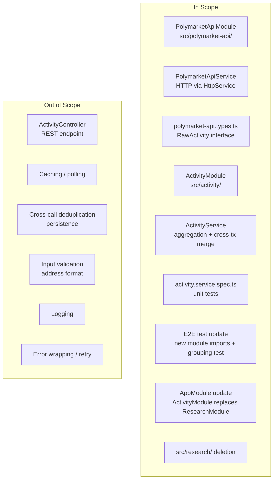
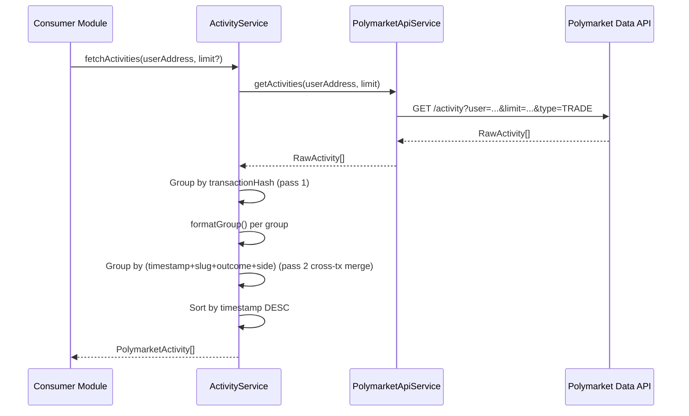

# PRD: Activity Module — POC to Production Promotion

**Date**: 2026-02-26
**Version**: 1.0
**Status**: Final

---

## Overview

### One-line Summary

Promote the Polymarket activity-fetching POC from a single research service into two properly separated, production-ready NestJS modules — one for API communication and one for business logic — with full unit test coverage and an improved cross-transaction deduplication step.

### Background

The Polymarket activity service was built as a POC in `src/research/` to prove that the Polymarket Data API integration works and to validate the aggregation algorithm ported from a Python script. The POC intentionally cut corners: raw axios (not injectable), no unit tests, no separation between API communication and business logic, and a monolithic service file that handles both HTTP calls and aggregation in the same class.

The service is now used as a foundation for future product features (notifications, analysis endpoints). Before it can be safely extended or consumed by other modules, it must be promoted to production quality: the API layer must be injectable and testable in isolation, the business logic must have unit test coverage with mocked boundaries, and the module layout must follow NestJS conventions for a multi-module codebase.

A secondary improvement identified during POC review: the current aggregation pipeline groups trades only within the same transaction hash, but the Polymarket API can return semantically identical trades across different transaction hashes (same timestamp, market, outcome, and direction). These should be collapsed into a single output record to prevent duplicate entries from reaching consumers.

---

## User Stories

### Primary Users

The primary users of this feature are **other NestJS modules and services** within the poly-monkey application that consume trade activity data. There is no direct end-user-facing interface at this stage.

The secondary user is the **development team**, who will write, maintain, and extend the code going forward.

### User Stories

```
As a NestJS module author
I want to inject ActivityService into my module
So that I can retrieve a deduplicated, sorted list of Polymarket trade activities
for a given wallet address without knowing anything about the HTTP transport layer.
```

```
As a developer extending the activity pipeline
I want ActivityService to depend on an injectable PolymarketApiService
So that I can write unit tests for the aggregation logic by mocking the HTTP boundary
without making live network calls.
```

```
As a developer maintaining the codebase
I want the API communication layer and the business logic layer to live in separate modules
So that I can change one without coupling risk to the other.
```

### Use Cases

1. A future notification module injects `ActivityService` and calls `fetchActivities(userAddress)` to detect new trades since the last poll.
2. A developer adds a unit test for the cross-transaction grouping logic by providing fixture `RawActivity[]` data directly to `ActivityService`, with `PolymarketApiService` mocked at the boundary.
3. A developer replaces the HTTP transport (for example, to add retry or circuit-breaking) by modifying only `PolymarketApiService` without touching `ActivityService`.

---

## Functional Requirements

### Must Have (MVP)

- [ ] **FR-1: PolymarketApiModule** — A dedicated NestJS module (`src/polymarket-api/`) that wraps `@nestjs/axios` `HttpService` and exposes `PolymarketApiService` as an injectable provider.
  - AC: `PolymarketApiModule` imports `HttpModule` from `@nestjs/axios` and exports `PolymarketApiService`. Any module that imports `PolymarketApiModule` can resolve `PolymarketApiService` via NestJS DI.

- [ ] **FR-2: PolymarketApiService** — The service issues `GET https://data-api.polymarket.com/activity` with params `user`, `limit`, `type=TRADE`, `sortBy=TIMESTAMP`, `sortDirection=DESC` using injected `HttpService`. It returns a `Promise<RawActivity[]>`. The `limit` parameter is required (not optional) on this service boundary — the default value of `100` is the responsibility of `ActivityService.fetchActivities`, not of `PolymarketApiService`.
  - AC: When called with a valid Ethereum address, `PolymarketApiService.getActivities(userAddress: string, limit: number)` returns the raw activity array from the API. HTTP errors propagate as thrown exceptions without wrapping.

- [ ] **FR-3: RawActivity type definition** — API type definitions, including the `RawActivity` interface, reside in `src/polymarket-api/polymarket-api.types.ts` and are exported for use by `ActivityService`.
  - AC: `RawActivity` is importable from `polymarket-api.types.ts`. It defines all optional fields returned by the Polymarket Data API: `transactionHash`, `timestamp`, `title`, `eventSlug`, `slug`, `outcome`, `side`, `usdcSize`, `size`, `price`.

- [ ] **FR-4: ActivityModule** — A dedicated NestJS module (`src/activity/`) that imports `PolymarketApiModule` and provides `ActivityService`.
  - AC: `ActivityModule` imports `PolymarketApiModule` and exports `ActivityService`. Any module that imports `ActivityModule` can resolve `ActivityService` via NestJS DI.

- [ ] **FR-5: ActivityService — first grouping pass (by transactionHash)** — `ActivityService.fetchActivities(userAddress, limit?)` retrieves raw records from `PolymarketApiService`, groups them by `transactionHash` (fallback key: `unknown_<timestamp>`), and aggregates each group into a single `PolymarketActivity` record using a unified `formatGroup` function.
  - AC: Single-record and multi-record groups both produce a `PolymarketActivity` that satisfies the existing field contract (`transactionHash`, `date`, `eventTitle`, `eventLink`, `marketSlug`, `outcomePurchased`, `side`, `totalPriceUsd`, `numTokens`, `avgPricePerToken`, `activityCount`). Numeric rounding rules are preserved: `totalPriceUsd` and `numTokens` at 2dp; `avgPricePerToken` at 4dp for multi-record groups, raw `price` rounded to 4dp for single-record groups. For multi-record groups, `outcomePurchased` is the unique outcome values from all records in the group, sorted alphabetically and joined with `', '`.

- [ ] **FR-6: formatGroup consolidation** — The two private formatting methods `formatSingle` and `aggregateGroup` from the POC are collapsed into a single `formatGroup(records: RawActivity[], key: string): PolymarketActivity` function. The observable output for both single-record and multi-record inputs is identical to the current POC.
  - AC: Given a single-record group `[record]`, `formatGroup` produces the same output as the POC's `formatSingle`. Given a multi-record group, it produces the same output as the POC's `aggregateGroup`.

- [ ] **FR-7: Second grouping pass (cross-transaction merging)** — After the first aggregation pass produces intermediate `PolymarketActivity` records, a second pass merges any records sharing the same composite key `(numeric timestamp + marketSlug + outcomePurchased + side)`. This pass executes on intermediate pipeline state where the raw numeric timestamp is still accessible (before date-string formatting), so exact integer equality is used for the timestamp component of the key. The `outcomePurchased` component of the composite key is the pass-1 formatted string (alphabetically sorted unique outcomes joined with `', '`), not the raw `outcome` field from `RawActivity`. Records with different `transactionHash` values are merged if all four key fields are identical.
  - AC: Given two intermediate records that share the same numeric `timestamp`, `marketSlug`, `outcomePurchased`, and `side` (regardless of `transactionHash`), the output array contains exactly one merged record with `totalPriceUsd` equal to the sum of both, `numTokens` equal to the sum of both, `avgPricePerToken` recomputed as `totalPriceUsd / numTokens` from the merged totals (rounded to 4dp), and `activityCount` equal to the sum of both.
  - AC: Records that do not share all four composite-key fields are not merged; each appears as its own record in the output.
  - AC: The `transactionHash` field of the merged record is set to the `transactionHash` of the first record in the merged group (input order preserved).

- [ ] **FR-8: Sort order preserved** — The final output of `fetchActivities` is sorted by numeric `timestamp` descending. This applies after both grouping passes. The numeric timestamp used internally for aggregation and sorting is not required to appear in the output `PolymarketActivity` interface.
  - AC: For any two adjacent items `[i]` and `[i+1]` in the result, the internal numeric timestamp of item `[i]` is greater than or equal to that of item `[i+1]`. Records with a missing or zero timestamp appear last.

- [ ] **FR-9: AppModule updated** — `AppModule` imports `ActivityModule` in place of the now-deleted `ResearchModule`.
  - AC: The application starts without error after the swap. The existing `test/app.e2e-spec.ts` continues to pass.

- [ ] **FR-10: POC cleanup** — `src/research/polymarket-activity.service.ts` and `src/research/polymarket-activity.module.ts` (i.e., the entire `src/research/` directory) are deleted.
  - AC: No file under `src/research/` exists after the change. No import in the remaining codebase references `src/research/`.

- [ ] **FR-11: Unit tests for ActivityService** — Unit tests in `src/activity/activity.service.spec.ts` cover the aggregation and merging logic with `PolymarketApiService` mocked at the boundary.
  - AC: Tests cover at minimum: single-record group output shape, multi-record group aggregation math (sum, avg price, alphabetically sorted outcome join), cross-transaction merge when all four key fields match, no merge when any key field differs, sort order (descending timestamp), missing-timestamp treated as `0` for sort.

- [ ] **FR-12: E2E test updated** — `test/polymarket-activity.e2e-spec.ts` is updated to import from `ActivityModule` / `ActivityService` (not `ResearchModule`) and adds a deterministic fixture-based test case that exercises the cross-transaction grouping logic.
  - AC: The updated e2e test passes. It imports `ActivityModule` and `ActivityService`.
  - AC: A fixture-based test case provides two synthetic `RawActivity` records sharing the same `timestamp`, `slug`, `outcome`, and `side` but different `transactionHash` values, calls `ActivityService` with `PolymarketApiService` mocked to return these fixtures, and asserts the output contains exactly one merged record with the correct summed `totalPriceUsd`, `numTokens`, `activityCount`, and recomputed `avgPricePerToken`.
  - AC: The live-API test (calling the real Polymarket API with the known test address) continues to pass and returns a non-empty array of at most 50 items (matching the `limit=50` argument) with all required fields present.

### Nice to Have

- [ ] Expose `timestamp` as a numeric field on `PolymarketActivity` so downstream consumers and tests can assert sort order directly without relying on the string `date` field.
- [ ] Configurable base URL for `PolymarketApiService` via `ConfigService` to support environment-level overrides without code changes.

### Out of Scope

- **REST controller / HTTP endpoint**: No `ActivityController` is created. The service is available via DI only.
- **Caching / polling**: No in-memory cache or background scheduling is added. Calls remain stateless.
- **Deduplication between calls**: No persistence or cross-call state tracking. Each `fetchActivities` call is independent.
- **Input validation**: No format enforcement on `userAddress` (e.g., checksum or regex). Lowercasing before use is the only transform applied.
- **Logging**: No structured logging added. The service remains lean.
- **Error wrapping**: HTTP errors from `PolymarketApiService` propagate as-is to the caller. No custom error classes or retry logic.

---

## Non-Functional Requirements

### Reliability

- HTTP errors from `PolymarketApiService` propagate as unhandled exceptions to the caller. The service does not swallow errors or return partial results.
- All optional raw API fields have explicit fallback values so the output type guarantee (`PolymarketActivity`) is always met, even when the API omits fields.

### Maintainability

- `PolymarketApiService` is injected into `ActivityService` via NestJS DI. The HTTP layer is never directly imported in the business logic layer.
- `formatGroup` is a single, unified function. There are no divergent single-record and multi-record code paths.
- Unit tests mock at the `PolymarketApiService` boundary. They do not mock internal methods of `ActivityService`.

### Security

- The Polymarket Data API is a public endpoint (HTTPS). No credentials are required.
- The `userAddress` parameter is lowercased before use as a query parameter. It is not evaluated as code, written to storage, or used in a file path.
- `@nestjs/axios` `HttpService` enforces HTTPS by using the API base URL directly; no TLS bypass is introduced.

### Testability

- `ActivityService` aggregation logic is fully testable with a mocked `PolymarketApiService` — no live network required for unit tests.
- The cross-transaction grouping logic can be exercised with in-process fixture data.

### Performance

No latency SLA is defined for this scope. Response time is governed by the Polymarket Data API round-trip; no additional processing overhead is introduced beyond in-memory grouping of at most 500 records per call.

### Scalability

The service is stateless. Each `fetchActivities` call is independent and allocates no shared state. Horizontal scaling is supported without coordination.

---

## Success Criteria

### Quantitative Metrics

1. All unit tests in `src/activity/activity.service.spec.ts` pass with 0 failures.
2. All e2e tests in `test/polymarket-activity.e2e-spec.ts` pass with 0 failures (including live API call).
3. Existing `test/app.e2e-spec.ts` continues to pass with 0 failures after `ActivityModule` replaces `ResearchModule` in `AppModule`.
4. Zero files remain under `src/research/` after cleanup.
5. Zero imports of `src/research/` remain in any file after cleanup.
6. Unit tests cover all six scenarios listed in FR-11 (single-record output, multi-record aggregation math, cross-transaction merge, no-merge on field mismatch, sort order, missing-timestamp sort).

### Qualitative Metrics

1. A developer can write a new consumer of trade activity data by injecting `ActivityService` without importing or knowing about `PolymarketApiService` or `@nestjs/axios`.
2. A developer can replace or extend the HTTP transport layer by modifying only `PolymarketApiService` without touching `ActivityService`.
3. The module layout (`src/activity/`, `src/polymarket-api/`) is immediately recognizable as idiomatic NestJS to any developer familiar with the framework.

---

## Scope Boundary



---

## User Journey



---

## Technical Considerations

### Dependencies

- `@nestjs/axios ^4.x` — must be added as a runtime dependency (compatible with NestJS 10/11). `HttpModule` and `HttpService` are provided by this package. Raw `axios` is no longer directly imported in this feature's code; `@nestjs/axios` `HttpService` is used instead. The `axios` package may remain in `package.json` as it is a peer dependency of `@nestjs/axios`.
- `@nestjs/testing` — already present (used in e2e tests).
- Existing `AppModule`, `AppController`, `AppService`, `main.ts` — must be untouched beyond the `imports` swap in `AppModule`.

### Constraints

- `PolymarketApiService` must use the injected `HttpService` (not raw `axios`) so the HTTP layer is mockable in unit tests.
- Module boundaries must be respected: `ActivityService` depends on `PolymarketApiService` via DI, never by direct import.
- TypeScript strict mode (`strictNullChecks`, `noImplicitAny`) applies to all new files.
- E2E test files must match the `.e2e-spec.ts$` suffix per `test/jest-e2e.json`.
- Unit test files must match the `.spec.ts$` suffix and reside under `src/` per the jest unit config.

### Assumptions

- The Polymarket Data API response structure is stable. `RawActivity` field definitions in `polymarket-api.types.ts` match the current API contract observed during POC.
- The known-active test address `0x2005d16a84ceefa912d4e380cd32e7ff827875ea` continues to have trade history available for the e2e test.
- `@nestjs/axios` is compatible with the project's current NestJS version. No major version conflict is anticipated.

### Risks and Mitigation

| Risk | Impact | Probability | Mitigation |
|------|--------|-------------|------------|
| Live API in e2e test is flaky or rate-limited | Medium | Low | Known-active address with limit=50; failure surfaces clearly. Acceptable for this scope. |
| Cross-transaction merge changes observable output for existing consumers | Medium | Low | No current consumers outside the e2e test. Output change is intentional and documented. E2e test is updated to assert the new behavior. |
| `@nestjs/axios` Observable vs Promise interface mismatch | Low | Low | `HttpService` methods return RxJS Observables; `firstValueFrom` from `rxjs` converts to Promise. This is idiomatic NestJS pattern. |
| Breaking import paths after `src/research/` deletion | Low | Low | Only two import sites reference `src/research/` (`app.module.ts` and `test/polymarket-activity.e2e-spec.ts`). Both are updated as part of this work. |

---

## Appendix

### References

- POC Design Document: `docs/design/polymarket-activity-service-design.md`
- Polymarket Data API (activity endpoint): `https://data-api.polymarket.com/activity`
- NestJS HttpModule documentation: `https://docs.nestjs.com/techniques/http-module`
- NestJS Modules documentation: `https://docs.nestjs.com/modules`
- NestJS Testing documentation: `https://docs.nestjs.com/fundamentals/testing`

### Glossary

- **ActivityModule**: The new production NestJS module at `src/activity/` that owns business logic for fetching and aggregating Polymarket trade activity.
- **ActivityService**: The NestJS injectable service inside `ActivityModule` that orchestrates API calls via `PolymarketApiService` and applies both grouping passes.
- **PolymarketApiModule**: The new NestJS module at `src/polymarket-api/` that wraps `@nestjs/axios` `HttpService` and exposes `PolymarketApiService`.
- **PolymarketApiService**: The NestJS injectable service that makes HTTP calls to the Polymarket Data API. It is the sole boundary between the application and the external API.
- **RawActivity**: The TypeScript interface representing a single unprocessed record returned by the Polymarket Data API. Defined in `polymarket-api.types.ts`.
- **PolymarketActivity**: The TypeScript interface representing a single aggregated, formatted trade activity record returned by `ActivityService` to its consumers.
- **Cross-transaction merge (pass 2)**: The second grouping step that collapses `PolymarketActivity` records sharing the same `(timestamp, marketSlug, outcomePurchased, side)` composite key into a single record, regardless of their `transactionHash` values.
- **formatGroup**: The unified formatting function in `ActivityService` that replaces the POC's separate `formatSingle` and `aggregateGroup` methods.
- **ResearchModule**: The POC module being deleted. Replaced by `ActivityModule`.

### Update History

| Date | Version | Changes | Author |
|------|---------|---------|--------|
| 2026-02-26 | 1.0 | Initial version | Claude (PRD) |
| 2026-02-26 | 1.2 | DS-C001: Added alphabetical sort requirement to outcomePurchased in FR-5, FR-7, FR-11. DS-C002: Added length<=50 upper-bound assertion to FR-12 live-API test AC. DS-C003: Clarified limit is required at PolymarketApiService.getActivities boundary in FR-2. | Claude (design-sync fix) |
| 2026-02-26 | 1.1 | I001: Clarified FR-7/FR-8 timestamp semantics (numeric timestamp on intermediate pipeline state, not PolymarketActivity.date string). I002: Added Performance and Scalability NFR subsections. I003: Removed implementation-internal AC from FR-6 (code path constraint moved to Design Doc). I004: Added @nestjs/axios version range and axios peer dependency note. I005: Strengthened FR-12 AC to require fixture-based cross-transaction merge assertion. I006: Fixed "replaced as the HTTP client" wording. | Claude (document-reviewer fix) |
